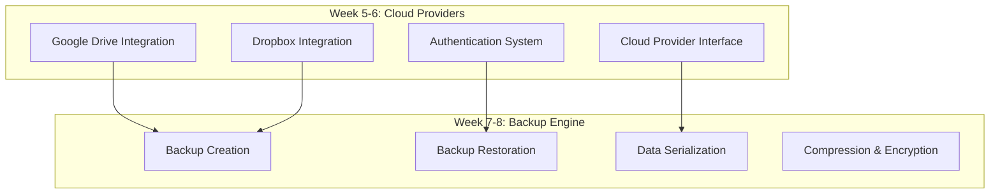
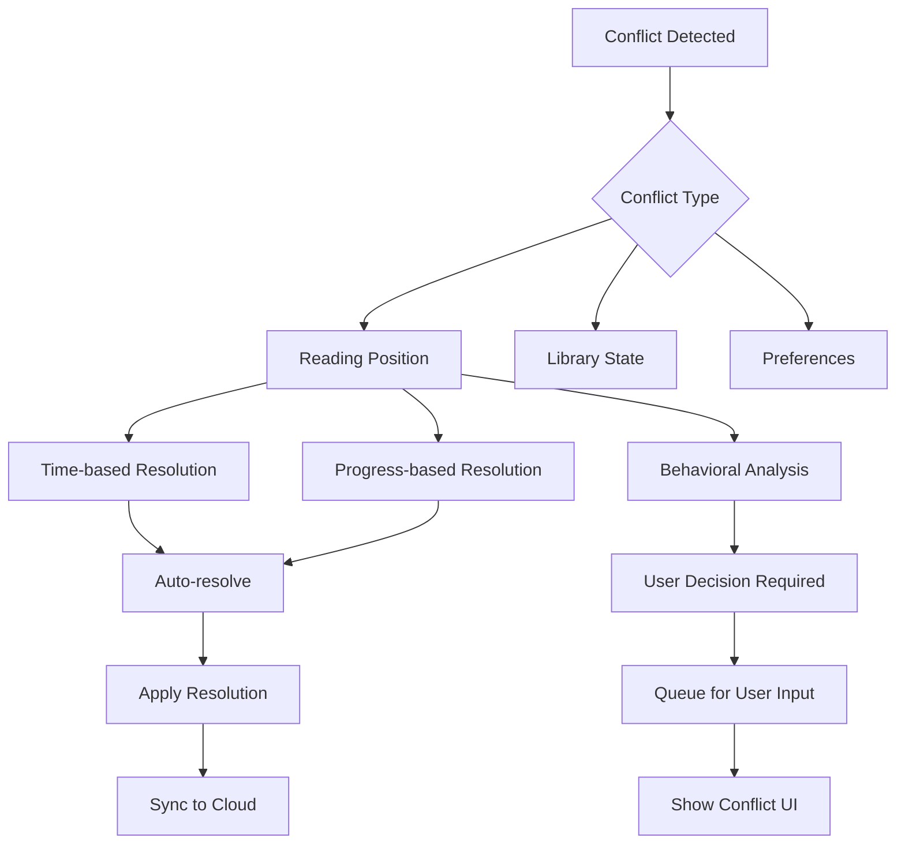
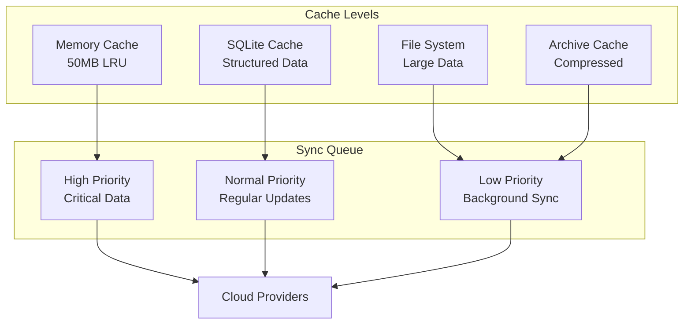
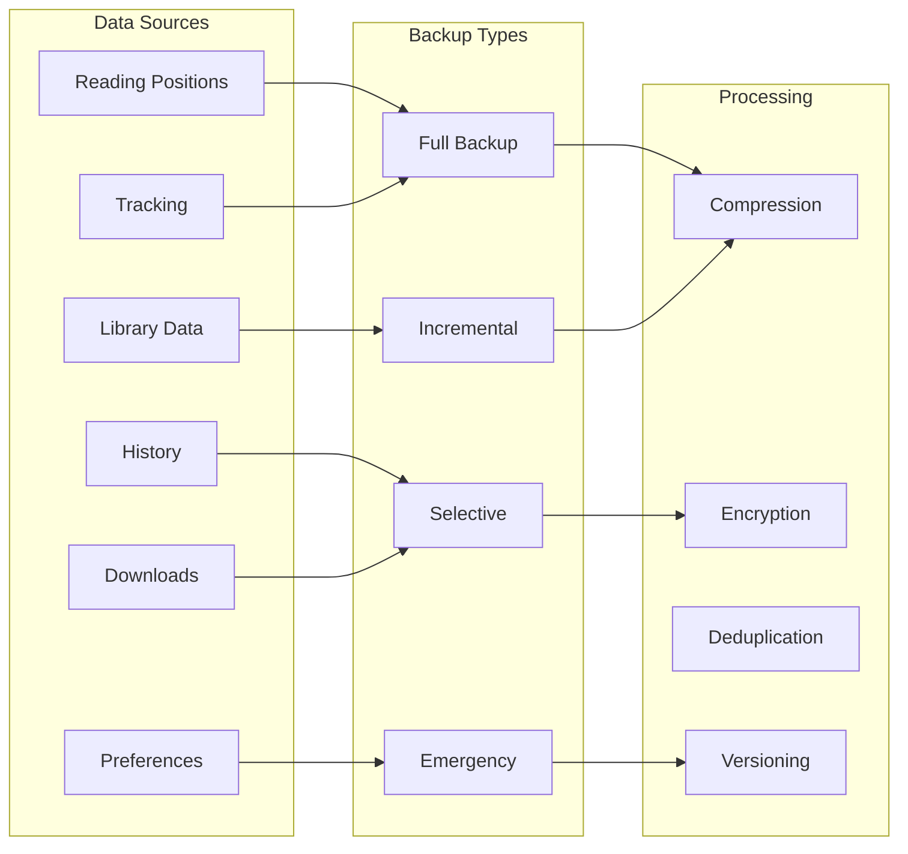
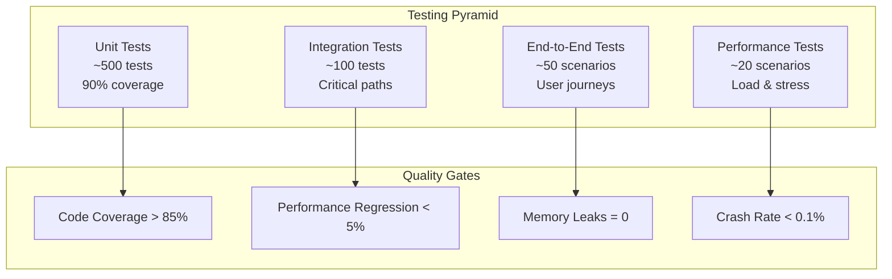
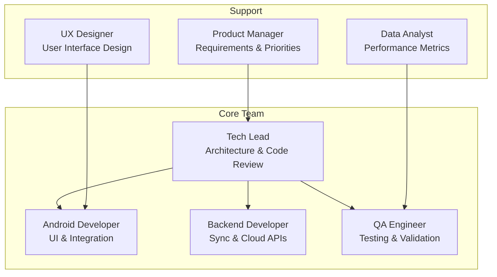

# Implementation Roadmap
## Multi-Device Reading Continuity & Smart Backup System

## 🗺️ Overview

This comprehensive implementation roadmap provides a phased approach to developing the Multi-Device Reading Continuity and Smart Backup System features for TachiyomiJ2K. The plan is structured to minimize risk, ensure incremental value delivery, and maintain app stability throughout development.

## 📅 Implementation Timeline

### Phase 1: Foundation Infrastructure (Weeks 1-4)
**Duration:** 4 weeks
**Risk Level:** Low
**Effort:** 160 developer hours

#### Week 1-2: Core Infrastructure

```mermaid
gantt
    title Phase 1: Foundation Infrastructure
    dateFormat  X
    axisFormat %s

    section Database Schema
    Extended Position Models    :milestone, m1, 0, 0s
    Sync Status Tables         :1, 0, 2
    Device Management Schema   :2, 2, 4

    section Sync Engine Core
    Basic Sync Queue          :3, 0, 3
    Network Monitor           :4, 2, 5
    Conflict Detection        :5, 4, 7

    section Data Models
    DetailedReadingPosition   :6, 0, 2
    SyncItem & SyncStatus     :7, 2, 4
    Device Information        :8, 4, 6
```


**Deliverables:**
- [ ] Extended database schema with sync support
- [ ] Basic sync queue implementation
- [ ] Network state monitoring
- [ ] Core data models for sync operations
- [ ] Device identification and management
- [ ] Basic conflict detection framework

**Technical Requirements:**
```kotlin
// Database migrations
class SyncSchemaMigration : Migration(15, 16) {
    override fun migrate(database: SupportSQLiteDatabase) {
        // Create sync-related tables
        database.execSQL("""
            CREATE TABLE IF NOT EXISTS detailed_reading_positions (
                id INTEGER PRIMARY KEY AUTOINCREMENT NOT NULL,
                manga_id INTEGER NOT NULL,
                chapter_id INTEGER NOT NULL,
                page_index INTEGER NOT NULL DEFAULT 0,
                scroll_progress REAL NOT NULL DEFAULT 0.0,
                horizontal_progress REAL NOT NULL DEFAULT 0.0,
                panel_index INTEGER,
                zoom_level REAL NOT NULL DEFAULT 1.0,
                viewport_center_x REAL NOT NULL DEFAULT 0.5,
                viewport_center_y REAL NOT NULL DEFAULT 0.5,
                reading_mode INTEGER NOT NULL DEFAULT 0,
                timestamp INTEGER NOT NULL,
                device_id TEXT NOT NULL,
                session_id TEXT NOT NULL,
                context_data TEXT,
                sync_status INTEGER NOT NULL DEFAULT 0,
                confidence_score REAL NOT NULL DEFAULT 1.0,
                FOREIGN KEY(manga_id) REFERENCES mangas(id) ON DELETE CASCADE,
                FOREIGN KEY(chapter_id) REFERENCES chapters(id) ON DELETE CASCADE
            )
        """)

        database.execSQL("""
            CREATE TABLE IF NOT EXISTS sync_queue (
                id TEXT PRIMARY KEY NOT NULL,
                type TEXT NOT NULL,
                priority INTEGER NOT NULL,
                data TEXT NOT NULL,
                timestamp INTEGER NOT NULL,
                attempts INTEGER NOT NULL DEFAULT 0,
                last_error TEXT,
                next_retry INTEGER NOT NULL DEFAULT 0,
                device_id TEXT NOT NULL,
                metadata TEXT
            )
        """)

        database.execSQL("""
            CREATE TABLE IF NOT EXISTS device_info (
                device_id TEXT PRIMARY KEY NOT NULL,
                device_name TEXT NOT NULL,
                device_type TEXT NOT NULL,
                screen_width INTEGER NOT NULL,
                screen_height INTEGER NOT NULL,
                screen_density REAL NOT NULL,
                android_version TEXT NOT NULL,
                app_version TEXT NOT NULL,
                last_seen INTEGER NOT NULL,
                is_current_device INTEGER NOT NULL DEFAULT 0,
                capabilities TEXT,
                preferences_profile TEXT
            )
        """)
    }
}
```

#### Week 3-4: Basic Sync Implementation
**Deliverables:**
- [ ] Simple reading position sync
- [ ] Local-first data management
- [ ] Basic conflict resolution (last-writer-wins)
- [ ] Network-aware sync scheduling
- [ ] Unit tests for core components

### Phase 2: Cloud Integration & Backup Foundation (Weeks 5-8)
**Duration:** 4 weeks
**Risk Level:** Medium
**Effort:** 180 developer hours

#### Cloud Provider Integration


**Deliverables:**
- [ ] Google Drive integration with OAuth2
- [ ] Dropbox integration with API v2
- [ ] Universal cloud provider interface
- [ ] Basic backup creation and restoration
- [ ] Data serialization with versioning
- [ ] Optional encryption for sensitive data

**Technical Milestones:**
```kotlin
// Cloud provider milestone validation
interface CloudProviderMilestone {
    suspend fun validateAuthentication(): Boolean
    suspend fun validateUpload(): Boolean
    suspend fun validateDownload(): Boolean
    suspend fun validateList(): Boolean
    suspend fun validateDelete(): Boolean

    fun getRequiredPermissions(): List<String>
    fun getStorageQuota(): StorageQuota
}

// Backup engine milestone validation
interface BackupEngineMilestone {
    suspend fun validateFullBackup(): BackupValidationResult
    suspend fun validateIncrementalBackup(): BackupValidationResult
    suspend fun validateRestoration(): RestorationValidationResult
    suspend fun validateEncryption(): EncryptionValidationResult

    fun getBackupSizeEstimate(): Long
    fun getCompressionRatio(): Float
}
```

### Phase 3: Advanced Sync Features (Weeks 9-12)
**Duration:** 4 weeks
**Risk Level:** Medium-High
**Effort:** 200 developer hours

#### Intelligent Conflict Resolution


**Deliverables:**
- [ ] Intelligent conflict resolution algorithms
- [ ] User behavior analysis for conflict resolution
- [ ] Conflict resolution UI components
- [ ] Advanced merge strategies
- [ ] Device preference management
- [ ] Selective sync configuration

**Code Quality Gates:**
- [ ] 90%+ test coverage for conflict resolution
- [ ] Performance benchmarks for sync operations
- [ ] Memory usage optimization
- [ ] Battery consumption analysis

### Phase 4: Offline-First Architecture (Weeks 13-16)
**Duration:** 4 weeks
**Risk Level:** High
**Effort:** 220 developer hours

#### Multi-Level Caching System


**Deliverables:**
- [ ] Multi-level caching system
- [ ] Intelligent sync queue with priority management
- [ ] Advanced network monitoring
- [ ] Offline conflict resolution
- [ ] Data persistence strategies
- [ ] Recovery mechanisms

**Performance Targets:**
- [ ] < 500ms for local data access
- [ ] < 2s for sync queue processing
- [ ] < 100MB memory usage for cache
- [ ] < 5% battery impact per day

### Phase 5: Smart Backup System (Weeks 17-20)
**Duration:** 4 weeks
**Risk Level:** Medium
**Effort:** 180 developer hours

#### Comprehensive Backup Features


**Deliverables:**
- [ ] Selective backup configuration
- [ ] Incremental backup system
- [ ] Multiple cloud provider support
- [ ] Backup verification and integrity checks
- [ ] Automated backup scheduling
- [ ] Disaster recovery procedures

### Phase 6: UI/UX Integration (Weeks 21-24)
**Duration:** 4 weeks
**Risk Level:** Low-Medium
**Effort:** 160 developer hours

#### User Interface Components
```kotlin
// Sync status UI component
@Composable
fun SyncStatusCard(
    syncState: SyncState,
    lastSyncTime: Long,
    conflictCount: Int,
    onSyncNow: () -> Unit,
    onResolveConflicts: () -> Unit
) {
    Card(
        modifier = Modifier
            .fillMaxWidth()
            .padding(16.dp),
        elevation = CardDefaults.cardElevation(defaultElevation = 4.dp)
    ) {
        Column(
            modifier = Modifier.padding(16.dp)
        ) {
            Row(
                modifier = Modifier.fillMaxWidth(),
                horizontalArrangement = Arrangement.SpaceBetween,
                verticalAlignment = Alignment.CenterVertically
            ) {
                Text(
                    text = "Sync Status",
                    style = MaterialTheme.typography.headlineSmall
                )

                SyncStatusIndicator(state = syncState)
            }

            Spacer(modifier = Modifier.height(8.dp))

            Text(
                text = "Last sync: ${formatLastSyncTime(lastSyncTime)}",
                style = MaterialTheme.typography.bodyMedium,
                color = MaterialTheme.colorScheme.onSurfaceVariant
            )

            if (conflictCount > 0) {
                Spacer(modifier = Modifier.height(8.dp))
                ConflictWarningBanner(
                    conflictCount = conflictCount,
                    onResolve = onResolveConflicts
                )
            }

            Spacer(modifier = Modifier.height(16.dp))

            Row(
                modifier = Modifier.fillMaxWidth(),
                horizontalArrangement = Arrangement.spacedBy(8.dp)
            ) {
                OutlinedButton(
                    onClick = onSyncNow,
                    modifier = Modifier.weight(1f)
                ) {
                    Icon(
                        imageVector = Icons.Default.Sync,
                        contentDescription = null,
                        modifier = Modifier.size(18.dp)
                    )
                    Spacer(modifier = Modifier.width(8.dp))
                    Text("Sync Now")
                }

                if (conflictCount > 0) {
                    Button(
                        onClick = onResolveConflicts,
                        modifier = Modifier.weight(1f)
                    ) {
                        Icon(
                            imageVector = Icons.Default.Warning,
                            contentDescription = null,
                            modifier = Modifier.size(18.dp)
                        )
                        Spacer(modifier = Modifier.width(8.dp))
                        Text("Resolve ($conflictCount)")
                    }
                }
            }
        }
    }
}
```

**Deliverables:**
- [ ] Sync status indicators and controls
- [ ] Conflict resolution UI flows
- [ ] Backup management interface
- [ ] Device management screens
- [ ] Settings integration
- [ ] User onboarding for sync features

### Phase 7: Testing & Optimization (Weeks 25-28)
**Duration:** 4 weeks
**Risk Level:** Low
**Effort:** 140 developer hours

#### Comprehensive Testing Strategy


**Testing Deliverables:**
- [ ] Comprehensive unit test suite
- [ ] Integration tests for sync scenarios
- [ ] End-to-end testing for critical user journeys
- [ ] Performance and load testing
- [ ] Security testing for encryption/authentication
- [ ] Usability testing and feedback integration

## 📊 Resource Requirements

### Development Team Structure


### Technical Infrastructure
- **Development Environment:** Android Studio Arctic Fox+, Kotlin 1.8+
- **Testing Infrastructure:** Automated CI/CD with comprehensive test suites
- **Cloud Services:** Google Drive API, Dropbox API, AWS S3 (optional)
- **Monitoring:** Firebase Analytics, Crashlytics, custom sync metrics
- **Database:** Room with SQLite, migration testing framework

### Estimated Costs
| Category | Cost (USD) | Duration |
|----------|------------|----------|
| Development Team | $84,000 | 28 weeks |
| Cloud Service APIs | $500/month | Ongoing |
| Testing Infrastructure | $2,000 | One-time |
| Security Audit | $5,000 | One-time |
| **Total** | **$91,500** | **Initial + Ongoing** |

## 🚨 Risk Management

### High-Risk Areas & Mitigation

#### 1. Data Synchronization Conflicts
**Risk Level:** High
**Impact:** Data loss, user frustration
**Mitigation:**
- Extensive testing with multiple devices
- Conservative conflict resolution strategies
- Comprehensive backup before sync operations
- User approval for destructive operations

#### 2. Cloud Provider API Changes
**Risk Level:** Medium
**Impact:** Sync functionality breaks
**Mitigation:**
- Abstract cloud provider interface
- Multiple provider support
- API versioning and fallback strategies
- Regular API compatibility testing

#### 3. Performance Degradation
**Risk Level:** Medium
**Impact:** App slowdown, battery drain
**Mitigation:**
- Continuous performance monitoring
- Efficient caching strategies
- Background sync optimization
- Resource usage limits and throttling

#### 4. Data Privacy & Security
**Risk Level:** High
**Impact:** User data exposure
**Mitigation:**
- End-to-end encryption for sensitive data
- Secure authentication flows
- Privacy-by-design principles
- Regular security audits

### Contingency Plans

#### Plan A: Delayed Cloud Integration
If cloud provider integration faces significant delays:
- **Week 5-8:** Focus on local sync between devices on same network
- **Week 9-12:** Implement manual backup/restore functionality
- **Week 13+:** Return to cloud integration with lessons learned

#### Plan B: Simplified Conflict Resolution
If advanced conflict resolution proves too complex:
- **Week 9-10:** Implement simple last-writer-wins strategy
- **Week 11-12:** Add user notification for conflicts
- **Week 13+:** Gradually enhance with user feedback

#### Plan C: Phased Feature Rollout
If timeline pressure increases:
- **Priority 1:** Basic reading position sync
- **Priority 2:** Simple backup/restore
- **Priority 3:** Advanced conflict resolution
- **Priority 4:** Multi-cloud support

## 📈 Success Metrics

### Technical KPIs
- **Sync Success Rate:** > 99.5%
- **Conflict Resolution Accuracy:** > 95%
- **Data Loss Incidents:** 0 per month
- **Sync Performance:** < 2 seconds for position updates
- **Memory Usage:** < 100MB additional overhead
- **Battery Impact:** < 5% per day

### User Experience KPIs
- **Feature Adoption Rate:** > 60% within 3 months
- **User Satisfaction Score:** > 4.5/5 for sync features
- **Support Ticket Reduction:** 30% fewer data loss reports
- **Reading Continuity:** 90% successful cross-device transitions

### Business KPIs
- **User Retention:** +15% for users with sync enabled
- **App Store Rating:** Maintain > 4.5 stars
- **Premium Feature Conversion:** 25% sync to premium upgrade
- **Development Velocity:** Maintain current feature delivery pace

## 🔄 Maintenance & Evolution

### Post-Launch Support (Months 1-3)
- **Week 1-2:** Critical bug fixes and hotfixes
- **Week 3-4:** Performance optimization based on real usage
- **Week 5-8:** User feedback integration and minor enhancements
- **Week 9-12:** Advanced features based on adoption metrics

### Long-term Evolution (Months 4-12)
- **Quarter 2:** Additional cloud providers (OneDrive, iCloud)
- **Quarter 3:** P2P sync for local networks
- **Quarter 4:** AI-powered reading recommendations based on sync data

### Version Compatibility
- **Backward Compatibility:** Support last 3 major versions
- **Forward Compatibility:** Design extensible data formats
- **Migration Strategy:** Automated data format upgrades
- **Rollback Plan:** Safe downgrade procedures for critical issues

This implementation roadmap provides a comprehensive, risk-managed approach to delivering sophisticated multi-device sync and backup capabilities while maintaining the high quality and stability that TachiyomiJ2K users expect.
