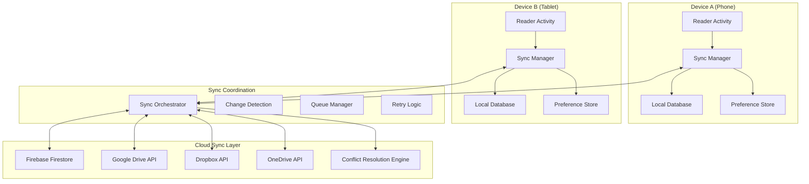
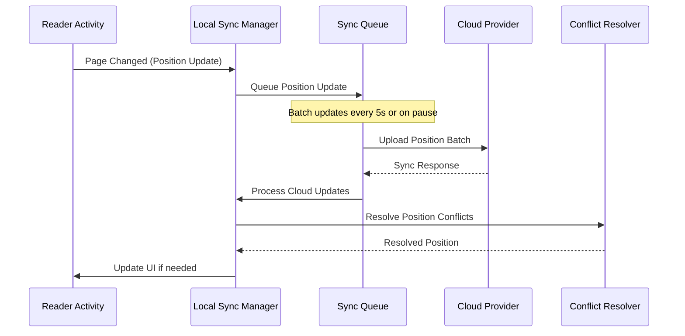
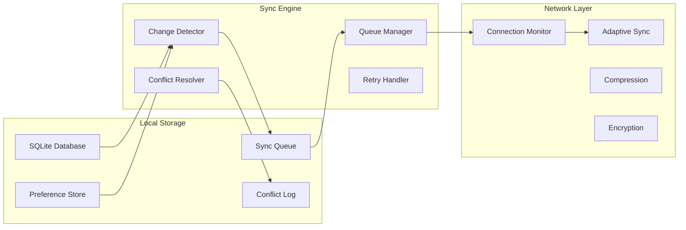
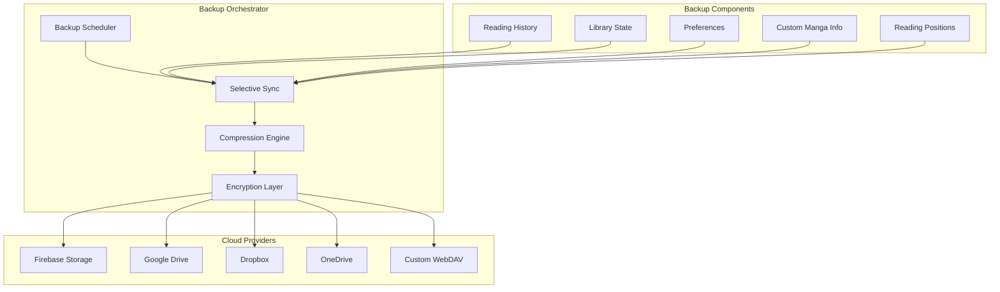

# Multi-Device Reading Continuity & Smart Backup System
## Comprehensive Architecture Planning for TachiyomiJ2K

### Current Architecture Analysis

Based on the examination of TachiyomiJ2K's codebase, the following components form the foundation for our multi-device sync system:

#### Existing Data Models
- **Reading Progress**: `History.kt` tracks `last_read`, `time_read`, `chapter_id`
- **Chapter State**: `Chapter.last_page_read`, `Chapter.pages_left`, `Chapter.read`
- **Preferences**: Comprehensive preference system via `PreferencesHelper`
- **Backup System**: Robust backup/restore with `BackupCreator` and `BackupRestorer`

#### Current Limitations
- No real-time sync between devices
- Single device-specific preferences
- Limited conflict resolution
- No granular reading position tracking (mid-page)
- Manual backup/restore only

---

## 🏗️ Multi-Device Sync Architecture

### System Overview



### Core Components

#### 1. Enhanced Reading Position Tracking

```kotlin
data class DetailedReadingPosition(
    val mangaId: Long,
    val chapterId: Long,
    val pageIndex: Int,
    val scrollProgress: Float, // 0.0 to 1.0 for mid-page position
    val panelIndex: Int?, // For panel-by-panel reading
    val zoomLevel: Float,
    val viewportX: Float,
    val viewportY: Float,
    val readingMode: Int,
    val timestamp: Long,
    val deviceId: String,
    val sessionId: String
)

data class ReadingSession(
    val sessionId: String,
    val startTime: Long,
    val endTime: Long?,
    val positions: List<DetailedReadingPosition>,
    val deviceType: DeviceType,
    val isActive: Boolean
)
```

#### 2. Device-Specific Configuration

```kotlin
enum class DeviceType {
    PHONE, TABLET, FOLDABLE, DESKTOP
}

data class DeviceProfile(
    val deviceId: String,
    val deviceType: DeviceType,
    val displayMetrics: DisplayMetrics,
    val capabilities: Set<DeviceCapability>
)

data class DeviceSpecificPreferences(
    val deviceId: String,
    val readerSettings: ReaderConfig,
    val uiSettings: UIConfig,
    val downloadSettings: DownloadConfig,
    val syncExclusions: Set<String> // Preferences to not sync
)

class DeviceAwarePreferenceStore {
    fun getPreference(key: String, deviceType: DeviceType): Any
    fun setPreference(key: String, value: Any, syncAcrossDevices: Boolean = true)
    fun getDeviceSpecificPreference(key: String, deviceId: String): Any
}
```

---

## 📊 Data Synchronization Architecture

### Reading Position Sync System



### Sync Data Models

```kotlin
data class SyncManifest(
    val version: Int,
    val lastUpdated: Long,
    val deviceManifests: Map<String, DeviceManifest>,
    val globalSequence: Long
)

data class DeviceManifest(
    val deviceId: String,
    val lastSyncTime: Long,
    val pendingChanges: List<ChangeRecord>,
    val conflictedItems: Set<String>
)

sealed class ChangeRecord {
    abstract val id: String
    abstract val timestamp: Long
    abstract val deviceId: String
    abstract val changeType: ChangeType

    data class ReadingPositionChange(
        override val id: String,
        override val timestamp: Long,
        override val deviceId: String,
        override val changeType: ChangeType,
        val position: DetailedReadingPosition,
        val previousPosition: DetailedReadingPosition?
    ) : ChangeRecord()

    data class PreferenceChange(
        override val id: String,
        override val timestamp: Long,
        override val deviceId: String,
        override val changeType: ChangeType,
        val key: String,
        val value: Any,
        val isDeviceSpecific: Boolean
    ) : ChangeRecord()

    data class LibraryChange(
        override val id: String,
        override val timestamp: Long,
        override val deviceId: String,
        override val changeType: ChangeType,
        val mangaId: Long,
        val changeData: LibraryChangeData
    ) : ChangeRecord()
}

enum class ChangeType {
    CREATE, UPDATE, DELETE, CONFLICT
}
```

---

## 🔄 Offline-First Architecture

### Local-First Sync Strategy



### Offline Queue Management

```kotlin
class OfflineSyncQueue {
    private val pendingChanges = mutableListOf<QueuedChange>()

    fun enqueue(change: ChangeRecord, priority: Priority = Priority.NORMAL) {
        val queuedChange = QueuedChange(
            change = change,
            priority = priority,
            attempts = 0,
            nextRetry = System.currentTimeMillis()
        )
        pendingChanges.add(queuedChange)
        scheduleSync()
    }

    suspend fun processQueue() {
        val readyChanges = pendingChanges
            .filter { it.nextRetry <= System.currentTimeMillis() }
            .sortedWith(compareBy<QueuedChange> { it.priority.ordinal }
                .thenBy { it.change.timestamp })

        readyChanges.chunked(BATCH_SIZE).forEach { batch ->
            processBatch(batch)
        }
    }

    private suspend fun processBatch(batch: List<QueuedChange>) {
        try {
            val result = cloudProvider.syncBatch(batch.map { it.change })
            handleSyncResult(batch, result)
        } catch (e: Exception) {
            handleSyncFailure(batch, e)
        }
    }
}

data class QueuedChange(
    val change: ChangeRecord,
    val priority: Priority,
    var attempts: Int,
    var nextRetry: Long
)

enum class Priority {
    HIGH,    // Reading position updates
    NORMAL,  // Preference changes
    LOW      // Metadata updates
}
```

---

## ⚔️ Conflict Resolution System

### Reading Position Conflicts

```kotlin
class ReadingPositionConflictResolver {
    fun resolveConflict(
        local: DetailedReadingPosition,
        remote: DetailedReadingPosition
    ): ResolutionResult {
        return when {
            // Most recent position wins if within same reading session
            local.sessionId == remote.sessionId ->
                if (local.timestamp > remote.timestamp) local else remote

            // Different sessions - check actual progress
            local.pageIndex != remote.pageIndex -> {
                val furthestPosition = if (local.pageIndex > remote.pageIndex) local else remote
                ResolutionResult.AutoResolved(furthestPosition)
            }

            // Same page, different scroll position - merge intelligently
            local.pageIndex == remote.pageIndex -> {
                val mergedPosition = local.copy(
                    scrollProgress = maxOf(local.scrollProgress, remote.scrollProgress),
                    timestamp = maxOf(local.timestamp, remote.timestamp)
                )
                ResolutionResult.AutoResolved(mergedPosition)
            }

            else -> ResolutionResult.RequiresUserInput(local, remote)
        }
    }
}

sealed class ResolutionResult {
    data class AutoResolved(val position: DetailedReadingPosition) : ResolutionResult()
    data class RequiresUserInput(
        val local: DetailedReadingPosition,
        val remote: DetailedReadingPosition
    ) : ResolutionResult()
}
```

### Conflict Resolution UI

```kotlin
class ConflictResolutionDialog : DialogFragment() {
    fun showPositionConflict(
        local: DetailedReadingPosition,
        remote: DetailedReadingPosition,
        onResolved: (DetailedReadingPosition) -> Unit
    ) {
        // Show comparison UI with:
        // - Visual preview of both positions
        // - Device information
        // - Timestamp information
        // - "Use Local", "Use Remote", "Merge" options
    }
}
```

---

## ☁️ Smart Backup System

### Multi-Cloud Integration Architecture



### Enhanced Backup Data Structure

```kotlin
data class EnhancedBackup(
    val metadata: BackupMetadata,
    val selectiveData: SelectiveBackupData,
    val deviceProfiles: Map<String, DeviceProfile>,
    val readingSessions: List<ReadingSession>,
    val conflictLog: List<ConflictRecord>
) {
    companion object {
        const val VERSION = 2
        const val MAGIC_HEADER = "TCH2K_V2"
    }
}

data class BackupMetadata(
    val version: Int = EnhancedBackup.VERSION,
    val createdAt: Long,
    val deviceId: String,
    val appVersion: String,
    val backupScope: BackupScope,
    val encryptionMethod: EncryptionMethod
)

data class SelectiveBackupData(
    val library: LibraryBackup?,
    val readingHistory: ReadingHistoryBackup?,
    val preferences: PreferencesBackup?,
    val downloads: DownloadBackup?,
    val trackingData: TrackingBackup?
)

class SelectiveBackupManager {
    fun createSelectiveBackup(
        scope: BackupScope,
        userSelections: BackupSelections
    ): EnhancedBackup {
        return EnhancedBackup(
            metadata = createMetadata(scope),
            selectiveData = buildSelectiveData(userSelections),
            deviceProfiles = getDeviceProfiles(),
            readingSessions = getReadingSessions(userSelections.timeRange),
            conflictLog = getRecentConflicts()
        )
    }

    fun restoreSelective(
        backup: EnhancedBackup,
        restoreSelections: RestoreSelections
    ): RestoreResult {
        // Implement selective restore logic
    }
}
```

### Cloud Provider Abstraction

```kotlin
interface CloudProvider {
    suspend fun upload(data: ByteArray, path: String): UploadResult
    suspend fun download(path: String): DownloadResult
    suspend fun list(prefix: String): List<CloudFile>
    suspend fun delete(path: String): Boolean
    suspend fun getQuota(): StorageQuota
}

class MultiCloudManager {
    private val providers = mutableMapOf<CloudProviderType, CloudProvider>()

    fun addProvider(type: CloudProviderType, provider: CloudProvider) {
        providers[type] = provider
    }

    suspend fun uploadToAllProviders(backup: EnhancedBackup): Map<CloudProviderType, UploadResult> {
        return providers.mapValues { (_, provider) ->
            try {
                val compressed = compressBackup(backup)
                val encrypted = encryptBackup(compressed)
                provider.upload(encrypted, generateBackupPath())
            } catch (e: Exception) {
                UploadResult.Failed(e)
            }
        }
    }

    suspend fun findBestBackup(): EnhancedBackup? {
        val backups = providers.values.map { provider ->
            try {
                provider.list("backups/").maxByOrNull { it.lastModified }
            } catch (e: Exception) {
                null
            }
        }.filterNotNull()

        return backups.maxByOrNull { it.lastModified }?.let { file ->
            downloadAndDecryptBackup(file)
        }
    }
}
```

---

## 🚀 Implementation Phases

### Phase 1: Foundation (4-6 weeks)
- Enhanced reading position tracking
- Local sync queue implementation
- Basic conflict detection
- Device identification system

### Phase 2: Core Sync (6-8 weeks)
- Cloud provider integration
- Real-time position synchronization
- Device-specific preferences
- Basic conflict resolution

### Phase 3: Advanced Features (4-6 weeks)
- Smart backup system
- Multi-cloud support
- Advanced conflict resolution UI
- Selective sync options

### Phase 4: Polish & Optimization (2-4 weeks)
- Performance optimization
- Error handling improvements
- User experience refinements
- Comprehensive testing

---

## 📱 User Experience Design

### Settings UI

```kotlin
class SyncSettingsFragment : PreferenceFragmentCompat() {
    override fun onCreatePreferences(savedInstanceState: Bundle?, rootKey: String?) {
        addPreferencesFromResource(R.xml.sync_preferences)

        setupDeviceSpecificSettings()
        setupCloudProviderSettings()
        setupSelectiveSyncSettings()
        setupConflictResolutionSettings()
    }

    private fun setupSelectiveSyncSettings() {
        findPreference<MultiSelectListPreference>("selective_sync_options")?.apply {
            entries = arrayOf(
                "Reading Positions",
                "Library State",
                "App Preferences",
                "Reading History",
                "Bookmarks",
                "Custom Manga Info"
            )
            values = arrayOf(
                "positions", "library", "preferences",
                "history", "bookmarks", "custom_info"
            )
        }
    }
}
```

### Sync Status Indicator

```kotlin
class SyncStatusView @JvmOverloads constructor(
    context: Context,
    attrs: AttributeSet? = null
) : LinearLayout(context, attrs) {

    fun updateSyncStatus(status: SyncStatus) {
        when (status) {
            is SyncStatus.Synced -> showSyncedState()
            is SyncStatus.Syncing -> showSyncingState(status.progress)
            is SyncStatus.Error -> showErrorState(status.error)
            is SyncStatus.Offline -> showOfflineState()
            is SyncStatus.Conflict -> showConflictState(status.conflicts)
        }
    }
}
```

---

## 🔧 Technical Implementation Details

### Database Schema Extensions

```sql
-- Enhanced reading positions table
CREATE TABLE reading_positions (
    id INTEGER PRIMARY KEY AUTOINCREMENT,
    manga_id INTEGER NOT NULL,
    chapter_id INTEGER NOT NULL,
    page_index INTEGER NOT NULL,
    scroll_progress REAL NOT NULL DEFAULT 0.0,
    panel_index INTEGER,
    zoom_level REAL NOT NULL DEFAULT 1.0,
    viewport_x REAL NOT NULL DEFAULT 0.0,
    viewport_y REAL NOT NULL DEFAULT 0.0,
    reading_mode INTEGER NOT NULL,
    timestamp INTEGER NOT NULL,
    device_id TEXT NOT NULL,
    session_id TEXT NOT NULL,
    sync_status INTEGER NOT NULL DEFAULT 0,
    UNIQUE(manga_id, chapter_id, device_id)
);

-- Device profiles table
CREATE TABLE device_profiles (
    device_id TEXT PRIMARY KEY,
    device_type INTEGER NOT NULL,
    display_width INTEGER NOT NULL,
    display_height INTEGER NOT NULL,
    display_density REAL NOT NULL,
    capabilities TEXT NOT NULL, -- JSON array
    last_seen INTEGER NOT NULL,
    is_current_device INTEGER NOT NULL DEFAULT 0
);

-- Sync queue table
CREATE TABLE sync_queue (
    id INTEGER PRIMARY KEY AUTOINCREMENT,
    change_type TEXT NOT NULL,
    change_data TEXT NOT NULL, -- JSON
    priority INTEGER NOT NULL DEFAULT 1,
    attempts INTEGER NOT NULL DEFAULT 0,
    next_retry INTEGER NOT NULL,
    created_at INTEGER NOT NULL,
    device_id TEXT NOT NULL
);

-- Conflict resolution table
CREATE TABLE sync_conflicts (
    id INTEGER PRIMARY KEY AUTOINCREMENT,
    conflict_type TEXT NOT NULL,
    local_data TEXT NOT NULL, -- JSON
    remote_data TEXT NOT NULL, -- JSON
    created_at INTEGER NOT NULL,
    resolved_at INTEGER,
    resolution_choice TEXT, -- 'local', 'remote', 'merged', 'custom'
    resolved_data TEXT -- JSON
);
```

### Service Architecture

```kotlin
class SyncService : Service() {
    private lateinit var syncManager: SyncManager
    private lateinit var conflictResolver: ConflictResolver

    override fun onCreate() {
        super.onCreate()
        syncManager = SyncManager(applicationContext)
        conflictResolver = ConflictResolver()

        startForegroundService()
        schedulePeriodicSync()
    }

    private fun schedulePeriodicSync() {
        val workRequest = PeriodicWorkRequestBuilder<SyncWorker>(
            15, TimeUnit.MINUTES,
            5, TimeUnit.MINUTES
        ).setConstraints(
            Constraints.Builder()
                .setRequiredNetworkType(NetworkType.CONNECTED)
                .setRequiresBatteryNotLow(true)
                .build()
        ).build()

        WorkManager.getInstance(this)
            .enqueueUniquePeriodicWork(
                "sync_work",
                ExistingPeriodicWorkPolicy.KEEP,
                workRequest
            )
    }
}

class SyncWorker(
    context: Context,
    params: WorkerParameters
) : CoroutineWorker(context, params) {

    override suspend fun doWork(): Result {
        return try {
            val syncManager = SyncManager(applicationContext)
            syncManager.performSync()
            Result.success()
        } catch (e: Exception) {
            if (runAttemptCount < 3) {
                Result.retry()
            } else {
                Result.failure()
            }
        }
    }
}
```

---

This comprehensive architecture provides a robust foundation for implementing multi-device reading continuity and smart backup features in TachiyomiJ2K, ensuring seamless user experience across all devices while maintaining data integrity and conflict resolution capabilities.
