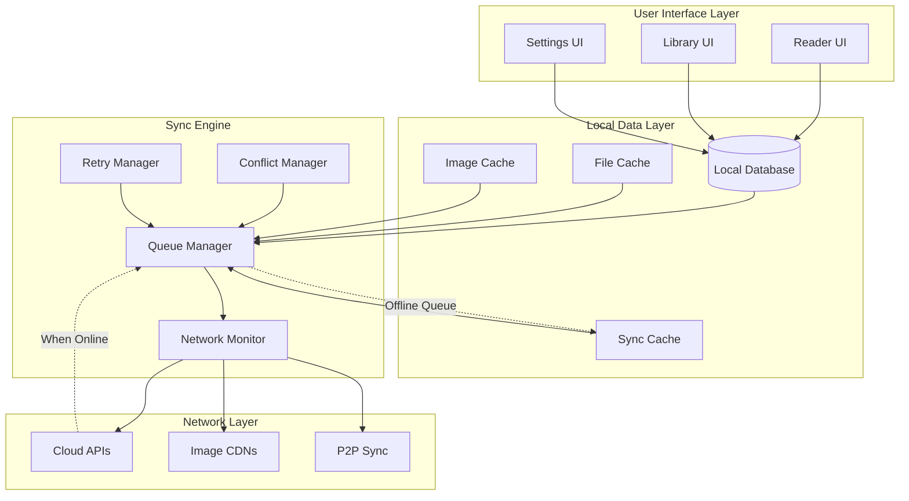

# Offline-First Architecture Plan
## Seamless Reading Experience with Poor Connectivity

## 🎯 Overview

The Offline-First Architecture ensures TachiyomiJ2K provides a seamless reading experience even with poor or intermittent connectivity. This system prioritizes local data, intelligent caching, and resilient sync mechanisms to maintain functionality regardless of network conditions.

## 🏗️ Core Architecture Principles

### Local-First Data Flow



### Data Persistence Strategy

```kotlin
enum class DataPersistenceLevel {
    CRITICAL,     // Must be preserved at all costs (reading positions, library)
    IMPORTANT,    // Should be preserved when possible (preferences, history)
    CACHE,        // Can be recreated from network (images, metadata)
    TEMPORARY     // Session-only data (UI state)
}

data class PersistencePolicy(
    val level: DataPersistenceLevel,
    val syncPriority: SyncPriority,
    val retentionDays: Int,
    val compressionEnabled: Boolean,
    val encryptionEnabled: Boolean,
    val conflictResolution: ConflictResolutionPolicy
)

class DataPersistenceManager(
    private val database: AppDatabase,
    private val fileSystem: FileSystemManager,
    private val encryptionManager: EncryptionManager
) {

    private val persistencePolicies = mapOf(
        "reading_positions" to PersistencePolicy(
            level = DataPersistenceLevel.CRITICAL,
            syncPriority = SyncPriority.HIGH,
            retentionDays = Int.MAX_VALUE,
            compressionEnabled = true,
            encryptionEnabled = false,
            conflictResolution = ConflictResolutionPolicy.MERGE_INTELLIGENT
        ),
        "library_manga" to PersistencePolicy(
            level = DataPersistenceLevel.CRITICAL,
            syncPriority = SyncPriority.HIGH,
            retentionDays = Int.MAX_VALUE,
            compressionEnabled = false,
            encryptionEnabled = false,
            conflictResolution = ConflictResolutionPolicy.LAST_WRITER_WINS
        ),
        "manga_chapters" to PersistencePolicy(
            level = DataPersistenceLevel.IMPORTANT,
            syncPriority = SyncPriority.NORMAL,
            retentionDays = 90,
            compressionEnabled = true,
            encryptionEnabled = false,
            conflictResolution = ConflictResolutionPolicy.MERGE_TIMESTAMPS
        ),
        "downloaded_images" to PersistencePolicy(
            level = DataPersistenceLevel.CACHE,
            syncPriority = SyncPriority.LOW,
            retentionDays = 30,
            compressionEnabled = false,
            encryptionEnabled = false,
            conflictResolution = ConflictResolutionPolicy.SKIP
        ),
        "user_preferences" to PersistencePolicy(
            level = DataPersistenceLevel.IMPORTANT,
            syncPriority = SyncPriority.NORMAL,
            retentionDays = Int.MAX_VALUE,
            compressionEnabled = true,
            encryptionEnabled = true,
            conflictResolution = ConflictResolutionPolicy.USER_CHOICE
        )
    )

    suspend fun persist(
        dataType: String,
        data: Any,
        metadata: PersistenceMetadata = PersistenceMetadata()
    ): PersistenceResult {
        val policy = persistencePolicies[dataType] ?: getDefaultPolicy()

        return try {
            when (policy.level) {
                DataPersistenceLevel.CRITICAL -> persistCriticalData(dataType, data, policy, metadata)
                DataPersistenceLevel.IMPORTANT -> persistImportantData(dataType, data, policy, metadata)
                DataPersistenceLevel.CACHE -> persistCacheData(dataType, data, policy, metadata)
                DataPersistenceLevel.TEMPORARY -> persistTemporaryData(dataType, data, metadata)
            }
        } catch (e: Exception) {
            handlePersistenceFailure(dataType, data, policy, e)
        }
    }

    private suspend fun persistCriticalData(
        dataType: String,
        data: Any,
        policy: PersistencePolicy,
        metadata: PersistenceMetadata
    ): PersistenceResult {
        // Multiple redundancy for critical data
        val results = mutableListOf<Boolean>()

        // Primary storage (database)
        results.add(database.persistData(dataType, data, metadata))

        // Secondary storage (file system)
        val serializedData = serializeData(data, policy.compressionEnabled, policy.encryptionEnabled)
        results.add(fileSystem.writeToSecondaryStorage(dataType, serializedData))

        // Tertiary storage (app-specific backup)
        results.add(fileSystem.writeToTertiaryStorage(dataType, serializedData))

        // At least one storage method must succeed for critical data
        return if (results.any { it }) {
            PersistenceResult.Success(redundancyLevel = results.count { it })
        } else {
            PersistenceResult.Failure("All storage methods failed for critical data")
        }
    }

    private suspend fun persistImportantData(
        dataType: String,
        data: Any,
        policy: PersistencePolicy,
        metadata: PersistenceMetadata
    ): PersistenceResult {
        // Primary + backup storage for important data
        val primarySuccess = database.persistData(dataType, data, metadata)

        if (primarySuccess) {
            // Async backup to secondary storage
            GlobalScope.launch {
                val serializedData = serializeData(data, policy.compressionEnabled, policy.encryptionEnabled)
                fileSystem.writeToSecondaryStorage(dataType, serializedData)
            }
            return PersistenceResult.Success(redundancyLevel = 1)
        } else {
            // Fallback to file system
            val serializedData = serializeData(data, policy.compressionEnabled, policy.encryptionEnabled)
            val fallbackSuccess = fileSystem.writeToSecondaryStorage(dataType, serializedData)

            return if (fallbackSuccess) {
                PersistenceResult.Success(redundancyLevel = 1, fallbackUsed = true)
            } else {
                PersistenceResult.Failure("Both primary and fallback storage failed")
            }
        }
    }
}

data class PersistenceMetadata(
    val timestamp: Long = System.currentTimeMillis(),
    val deviceId: String = "",
    val version: Int = 1,
    val checksum: String = "",
    val tags: Set<String> = emptySet()
)

sealed class PersistenceResult {
    data class Success(
        val redundancyLevel: Int,
        val fallbackUsed: Boolean = false
    ) : PersistenceResult()

    data class Failure(val reason: String) : PersistenceResult()
}

enum class ConflictResolutionPolicy {
    LAST_WRITER_WINS,
    MERGE_INTELLIGENT,
    MERGE_TIMESTAMPS,
    USER_CHOICE,
    SKIP
}
```

## 🔄 Intelligent Sync Queue System

### Multi-Tier Queue Architecture

```kotlin
class IntelligentSyncQueue(
    private val database: AppDatabase,
    private val networkMonitor: NetworkMonitor,
    private val cloudProvider: CloudProvider,
    private val conflictResolver: ConflictResolver
) {

    companion object {
        private const val HIGH_PRIORITY_BATCH_SIZE = 5
        private const val NORMAL_PRIORITY_BATCH_SIZE = 20
        private const val LOW_PRIORITY_BATCH_SIZE = 50
        private const val RETRY_BACKOFF_BASE = 2000L // 2 seconds
        private const val MAX_RETRY_ATTEMPTS = 5
    }

    private val highPriorityQueue = PriorityQueue<SyncItem>(compareBy { it.priority.ordinal })
    private val normalPriorityQueue = ArrayDeque<SyncItem>()
    private val lowPriorityQueue = ArrayDeque<SyncItem>()

    private val queueLock = Mutex()
    private val syncJob = SupervisorJob()
    private val syncScope = CoroutineScope(Dispatchers.IO + syncJob)

    init {
        startQueueProcessor()
        observeNetworkChanges()
    }

    suspend fun enqueue(item: SyncItem) {
        queueLock.withLock {
            when (item.priority) {
                SyncPriority.CRITICAL -> {
                    highPriorityQueue.offer(item)
                    triggerImmediateSync()
                }
                SyncPriority.HIGH -> {
                    highPriorityQueue.offer(item)
                }
                SyncPriority.NORMAL -> {
                    normalPriorityQueue.offer(item)
                }
                SyncPriority.LOW -> {
                    lowPriorityQueue.offer(item)
                }
            }

            // Persist queue state for crash recovery
            persistQueueState()
        }
    }

    private fun startQueueProcessor() {
        syncScope.launch {
            while (true) {
                try {
                    when (networkMonitor.getNetworkState()) {
                        NetworkState.CONNECTED_WIFI -> {
                            processBatch(LOW_PRIORITY_BATCH_SIZE) // Process all types
                        }
                        NetworkState.CONNECTED_MOBILE -> {
                            processBatch(NORMAL_PRIORITY_BATCH_SIZE) // Skip low priority
                        }
                        NetworkState.CONNECTED_POOR -> {
                            processBatch(HIGH_PRIORITY_BATCH_SIZE) // High priority only
                        }
                        NetworkState.DISCONNECTED -> {
                            delay(5000) // Wait for connection
                            continue
                        }
                    }

                    // Adaptive delay based on network conditions and queue size
                    val delayMs = calculateAdaptiveDelay()
                    delay(delayMs)

                } catch (e: Exception) {
                    // Log error and continue processing
                    Timber.e(e, "Error in sync queue processor")
                    delay(10000) // Back off on errors
                }
            }
        }
    }

    private suspend fun processBatch(maxBatchSize: Int) {
        val batch = mutableListOf<SyncItem>()

        queueLock.withLock {
            // Always process high priority first
            while (batch.size < maxBatchSize && highPriorityQueue.isNotEmpty()) {
                batch.add(highPriorityQueue.poll())
            }

            // Then normal priority
            while (batch.size < maxBatchSize && normalPriorityQueue.isNotEmpty()) {
                batch.add(normalPriorityQueue.removeFirst())
            }

            // Finally low priority (only on WiFi)
            if (networkMonitor.getNetworkState() == NetworkState.CONNECTED_WIFI) {
                while (batch.size < maxBatchSize && lowPriorityQueue.isNotEmpty()) {
                    batch.add(lowPriorityQueue.removeFirst())
                }
            }
        }

        if (batch.isNotEmpty()) {
            processSyncBatch(batch)
        }
    }

    private suspend fun processSyncBatch(batch: List<SyncItem>) {
        // Group items by type for efficient processing
        val groupedBatch = batch.groupBy { it.type }

        groupedBatch.forEach { (type, items) ->
            try {
                when (type) {
                    SyncItemType.READING_POSITION -> syncReadingPositions(items)
                    SyncItemType.LIBRARY_UPDATE -> syncLibraryUpdates(items)
                    SyncItemType.PREFERENCE_CHANGE -> syncPreferences(items)
                    SyncItemType.DOWNLOAD_STATE -> syncDownloadStates(items)
                    SyncItemType.BOOKMARK -> syncBookmarks(items)
                }

                // Mark items as successfully synced
                items.forEach { markSyncComplete(it) }

            } catch (e: Exception) {
                // Handle sync failures
                items.forEach { handleSyncFailure(it, e) }
            }
        }
    }

    private suspend fun syncReadingPositions(items: List<SyncItem>) {
        val positions = items.mapNotNull { it.data as? DetailedReadingPosition }

        // Use batch sync for efficiency
        val result = cloudProvider.syncPositionsBatch(positions)

        result.conflicts.forEach { (local, remote) ->
            val resolution = conflictResolver.resolvePositionConflict(local, remote)
            handleConflictResolution(local, remote, resolution)
        }
    }

    private suspend fun handleSyncFailure(item: SyncItem, error: Exception) {
        val updatedItem = item.copy(
            attempts = item.attempts + 1,
            lastError = error.message,
            nextRetry = calculateNextRetry(item.attempts)
        )

        if (updatedItem.attempts < MAX_RETRY_ATTEMPTS) {
            // Re-queue with exponential backoff
            scheduleRetry(updatedItem)
        } else {
            // Mark as permanently failed and notify user if critical
            markPermanentFailure(updatedItem)

            if (item.priority in listOf(SyncPriority.CRITICAL, SyncPriority.HIGH)) {
                notifyUserOfFailure(updatedItem)
            }
        }
    }

    private fun calculateNextRetry(attempts: Int): Long {
        val backoffMs = RETRY_BACKOFF_BASE * (1L shl attempts) // Exponential backoff
        val jitter = Random.nextLong(-1000, 1000) // Add jitter to prevent thundering herd
        return System.currentTimeMillis() + backoffMs + jitter
    }

    private fun calculateAdaptiveDelay(): Long {
        val networkState = networkMonitor.getNetworkState()
        val queueSize = getTotalQueueSize()

        return when {
            networkState == NetworkState.CONNECTED_WIFI && queueSize > 100 -> 1000L
            networkState == NetworkState.CONNECTED_WIFI -> 5000L
            networkState == NetworkState.CONNECTED_MOBILE && queueSize > 50 -> 3000L
            networkState == NetworkState.CONNECTED_MOBILE -> 10000L
            networkState == NetworkState.CONNECTED_POOR -> 30000L
            else -> 60000L
        }
    }

    private suspend fun observeNetworkChanges() {
        networkMonitor.networkStateFlow
            .distinctUntilChanged()
            .collect { networkState ->
                when (networkState) {
                    NetworkState.CONNECTED_WIFI -> {
                        // Aggressive sync on WiFi
                        triggerImmediateSync()
                    }
                    NetworkState.CONNECTED_MOBILE -> {
                        // Conservative sync on mobile
                        triggerConservativeSync()
                    }
                    NetworkState.CONNECTED_POOR -> {
                        // Only critical items
                        triggerCriticalSync()
                    }
                    NetworkState.DISCONNECTED -> {
                        // Pause sync operations
                        pauseSync()
                    }
                }
            }
    }
}

data class SyncItem(
    val id: String,
    val type: SyncItemType,
    val priority: SyncPriority,
    val data: Any,
    val timestamp: Long = System.currentTimeMillis(),
    val attempts: Int = 0,
    val lastError: String? = null,
    val nextRetry: Long = 0L,
    val deviceId: String,
    val metadata: Map<String, String> = emptyMap()
)

enum class SyncItemType {
    READING_POSITION,
    LIBRARY_UPDATE,
    PREFERENCE_CHANGE,
    DOWNLOAD_STATE,
    BOOKMARK,
    HISTORY_UPDATE,
    CUSTOM_MANGA_INFO
}

enum class SyncPriority {
    CRITICAL,  // Must sync immediately (user just closed app)
    HIGH,      // Should sync soon (reading position updates)
    NORMAL,    // Can wait for good network (preference changes)
    LOW        // Background sync (metadata updates)
}

enum class NetworkState {
    CONNECTED_WIFI,
    CONNECTED_MOBILE,
    CONNECTED_POOR,
    DISCONNECTED
}
```

## 📶 Advanced Network Monitoring

### Intelligent Network State Detection

```kotlin
class AdvancedNetworkMonitor(
    private val context: Context,
    private val preferences: PreferencesHelper
) {

    private val connectivityManager = context.getSystemService(Context.CONNECTIVITY_SERVICE) as ConnectivityManager
    private val telephonyManager = context.getSystemService(Context.TELEPHONY_SERVICE) as TelephonyManager

    private val _networkStateFlow = MutableStateFlow(NetworkState.DISCONNECTED)
    val networkStateFlow: StateFlow<NetworkState> = _networkStateFlow.asStateFlow()

    private val networkCallback = object : ConnectivityManager.NetworkCallback() {
        override fun onAvailable(network: Network) {
            updateNetworkState()
        }

        override fun onLost(network: Network) {
            updateNetworkState()
        }

        override fun onCapabilitiesChanged(
            network: Network,
            networkCapabilities: NetworkCapabilities
        ) {
            updateNetworkState()
        }
    }

    init {
        if (Build.VERSION.SDK_INT >= Build.VERSION_CODES.N) {
            connectivityManager.registerDefaultNetworkCallback(networkCallback)
        }
        updateNetworkState()
    }

    fun getNetworkState(): NetworkState {
        return _networkStateFlow.value
    }

    fun getDetailedNetworkInfo(): DetailedNetworkInfo {
        val activeNetwork = connectivityManager.activeNetwork
        val networkCapabilities = connectivityManager.getNetworkCapabilities(activeNetwork)

        return if (networkCapabilities != null) {
            DetailedNetworkInfo(
                isConnected = true,
                isWifi = networkCapabilities.hasTransport(NetworkCapabilities.TRANSPORT_WIFI),
                isMobile = networkCapabilities.hasTransport(NetworkCapabilities.TRANSPORT_CELLULAR),
                isEthernet = networkCapabilities.hasTransport(NetworkCapabilities.TRANSPORT_ETHERNET),
                isMetered = connectivityManager.isActiveNetworkMetered,
                linkDownstreamBandwidthKbps = networkCapabilities.linkDownstreamBandwidthKbps,
                linkUpstreamBandwidthKbps = networkCapabilities.linkUpstreamBandwidthKbps,
                signalStrength = getSignalStrength(),
                networkType = getNetworkType(),
                isRoaming = isRoaming()
            )
        } else {
            DetailedNetworkInfo(isConnected = false)
        }
    }

    private fun updateNetworkState() {
        val detailedInfo = getDetailedNetworkInfo()

        val newState = when {
            !detailedInfo.isConnected -> NetworkState.DISCONNECTED
            detailedInfo.isWifi -> NetworkState.CONNECTED_WIFI
            detailedInfo.isMobile -> {
                // Determine mobile connection quality
                when {
                    detailedInfo.signalStrength > 75 &&
                    detailedInfo.linkDownstreamBandwidthKbps > 1000 -> NetworkState.CONNECTED_MOBILE

                    detailedInfo.signalStrength > 50 &&
                    detailedInfo.linkDownstreamBandwidthKbps > 500 -> NetworkState.CONNECTED_MOBILE

                    else -> NetworkState.CONNECTED_POOR
                }
            }
            detailedInfo.isEthernet -> NetworkState.CONNECTED_WIFI // Treat ethernet as WiFi
            else -> NetworkState.CONNECTED_POOR
        }

        if (newState != _networkStateFlow.value) {
            _networkStateFlow.value = newState
            onNetworkStateChanged(newState, detailedInfo)
        }
    }

    private fun onNetworkStateChanged(newState: NetworkState, detailedInfo: DetailedNetworkInfo) {
        // Log network state changes for analytics
        Timber.d("Network state changed to: $newState, details: $detailedInfo")

        // Adjust sync behavior based on network conditions
        when (newState) {
            NetworkState.CONNECTED_WIFI -> {
                preferences.syncOnWifiOnly().set(false)
                preferences.enableBackgroundSync().set(true)
            }
            NetworkState.CONNECTED_MOBILE -> {
                if (detailedInfo.isMetered && preferences.respectMeteredConnections().get()) {
                    preferences.syncOnWifiOnly().set(true)
                }
            }
            NetworkState.CONNECTED_POOR -> {
                preferences.enableBackgroundSync().set(false)
            }
            NetworkState.DISCONNECTED -> {
                // Prepare for offline mode
                prepareOfflineMode()
            }
        }
    }

    private fun getSignalStrength(): Int {
        return if (Build.VERSION.SDK_INT >= Build.VERSION_CODES.P) {
            try {
                val signalStrength = telephonyManager.signalStrength
                signalStrength?.level?.let { (it * 25) } ?: 0 // Convert to percentage
            } catch (e: Exception) {
                0
            }
        } else {
            0
        }
    }

    private fun getNetworkType(): String {
        val activeNetwork = connectivityManager.activeNetwork
        val networkCapabilities = connectivityManager.getNetworkCapabilities(activeNetwork)

        return when {
            networkCapabilities?.hasTransport(NetworkCapabilities.TRANSPORT_WIFI) == true -> "WiFi"
            networkCapabilities?.hasTransport(NetworkCapabilities.TRANSPORT_CELLULAR) == true -> {
                if (Build.VERSION.SDK_INT >= Build.VERSION_CODES.Q) {
                    when (telephonyManager.dataNetworkType) {
                        TelephonyManager.NETWORK_TYPE_NR -> "5G"
                        TelephonyManager.NETWORK_TYPE_LTE -> "4G LTE"
                        else -> "Mobile"
                    }
                } else {
                    "Mobile"
                }
            }
            networkCapabilities?.hasTransport(NetworkCapabilities.TRANSPORT_ETHERNET) == true -> "Ethernet"
            else -> "Unknown"
        }
    }

    private fun isRoaming(): Boolean {
        return try {
            telephonyManager.isNetworkRoaming
        } catch (e: Exception) {
            false
        }
    }

    private fun prepareOfflineMode() {
        // Implement offline mode preparations
        // - Cache critical data
        // - Prepare queue for when connectivity returns
        // - Notify UI to show offline indicator
    }
}

data class DetailedNetworkInfo(
    val isConnected: Boolean,
    val isWifi: Boolean = false,
    val isMobile: Boolean = false,
    val isEthernet: Boolean = false,
    val isMetered: Boolean = false,
    val linkDownstreamBandwidthKbps: Int = 0,
    val linkUpstreamBandwidthKbps: Int = 0,
    val signalStrength: Int = 0, // 0-100 percentage
    val networkType: String = "Unknown",
    val isRoaming: Boolean = false
)
```

## 💾 Offline Data Caching Strategy

### Multi-Level Cache System

```kotlin
class OfflineDataCacheManager(
    private val context: Context,
    private val database: AppDatabase,
    private val preferences: PreferencesHelper
) {

    companion object {
        private const val CACHE_VERSION = 1
        private const val MAX_MEMORY_CACHE_SIZE = 50 * 1024 * 1024 // 50MB
        private const val MAX_DISK_CACHE_SIZE = 500 * 1024 * 1024 // 500MB
    }

    // Level 1: Memory Cache (fastest access)
    private val memoryCache = LruCache<String, CachedData>(
        (MAX_MEMORY_CACHE_SIZE / 1024).toInt()
    ) { _, cachedData ->
        cachedData.sizeInKB
    }

    // Level 2: SQLite Cache (persistent, structured)
    private val databaseCache = DatabaseCache(database)

    // Level 3: File System Cache (large data, images)
    private val fileSystemCache = FileSystemCache(context)

    // Level 4: Compressed Archive Cache (long-term storage)
    private val archiveCache = ArchiveCache(context)

    suspend fun cache(
        key: String,
        data: Any,
        cacheLevel: CacheLevel = CacheLevel.AUTO,
        ttl: Long = TimeUnit.HOURS.toMillis(24)
    ): CacheResult {
        val cachedData = CachedData(
            key = key,
            data = data,
            timestamp = System.currentTimeMillis(),
            ttl = ttl,
            accessCount = 0,
            lastAccess = System.currentTimeMillis(),
            sizeInKB = estimateDataSize(data)
        )

        val targetLevel = when (cacheLevel) {
            CacheLevel.AUTO -> determineCacheLevel(cachedData)
            else -> cacheLevel
        }

        return when (targetLevel) {
            CacheLevel.MEMORY -> cacheInMemory(cachedData)
            CacheLevel.DATABASE -> cacheInDatabase(cachedData)
            CacheLevel.FILE_SYSTEM -> cacheInFileSystem(cachedData)
            CacheLevel.ARCHIVE -> cacheInArchive(cachedData)
            CacheLevel.AUTO -> error("AUTO should have been resolved")
        }
    }

    suspend fun retrieve(key: String): CachedData? {
        // Check memory cache first (fastest)
        memoryCache.get(key)?.let { cachedData ->
            if (!cachedData.isExpired()) {
                cachedData.accessCount++
                cachedData.lastAccess = System.currentTimeMillis()
                return cachedData
            } else {
                memoryCache.remove(key)
            }
        }

        // Check database cache
        databaseCache.get(key)?.let { cachedData ->
            if (!cachedData.isExpired()) {
                // Promote to memory cache if frequently accessed
                if (cachedData.accessCount > 5) {
                    memoryCache.put(key, cachedData)
                }
                return cachedData
            } else {
                databaseCache.remove(key)
            }
        }

        // Check file system cache
        fileSystemCache.get(key)?.let { cachedData ->
            if (!cachedData.isExpired()) {
                return cachedData
            } else {
                fileSystemCache.remove(key)
            }
        }

        // Check archive cache (slowest but most persistent)
        archiveCache.get(key)?.let { cachedData ->
            if (!cachedData.isExpired()) {
                // Promote to higher level cache
                cacheInDatabase(cachedData)
                return cachedData
            } else {
                archiveCache.remove(key)
            }
        }

        return null
    }

    private fun determineCacheLevel(cachedData: CachedData): CacheLevel {
        return when {
            // Small, frequently accessed data -> Memory
            cachedData.sizeInKB < 100 && cachedData.accessCount > 10 -> CacheLevel.MEMORY

            // Structured data, medium size -> Database
            cachedData.data is List<*> || cachedData.data is Map<*, *> -> CacheLevel.DATABASE

            // Large data, images -> File System
            cachedData.sizeInKB > 1024 -> CacheLevel.FILE_SYSTEM

            // Long-term, rarely accessed -> Archive
            cachedData.ttl > TimeUnit.DAYS.toMillis(7) -> CacheLevel.ARCHIVE

            // Default to database
            else -> CacheLevel.DATABASE
        }
    }

    private suspend fun cacheInMemory(cachedData: CachedData): CacheResult {
        return try {
            memoryCache.put(cachedData.key, cachedData)
            CacheResult.Success(CacheLevel.MEMORY)
        } catch (e: Exception) {
            CacheResult.Failure("Memory cache failed: ${e.message}")
        }
    }

    private suspend fun cacheInDatabase(cachedData: CachedData): CacheResult {
        return try {
            databaseCache.put(cachedData)
            CacheResult.Success(CacheLevel.DATABASE)
        } catch (e: Exception) {
            // Fallback to file system
            cacheInFileSystem(cachedData)
        }
    }

    private suspend fun cacheInFileSystem(cachedData: CachedData): CacheResult {
        return try {
            fileSystemCache.put(cachedData)
            CacheResult.Success(CacheLevel.FILE_SYSTEM)
        } catch (e: Exception) {
            // Fallback to archive
            cacheInArchive(cachedData)
        }
    }

    private suspend fun cacheInArchive(cachedData: CachedData): CacheResult {
        return try {
            archiveCache.put(cachedData)
            CacheResult.Success(CacheLevel.ARCHIVE)
        } catch (e: Exception) {
            CacheResult.Failure("All cache levels failed: ${e.message}")
        }
    }

    suspend fun preloadCriticalData() {
        // Preload reading positions for recent manga
        val recentManga = database.historyDao().getRecentlyReadManga(50)
        recentManga.forEach { manga ->
            val positions = database.readingPositionDao().getAllPositionsForManga(manga.id!!)
            cache("positions_${manga.id}", positions, CacheLevel.MEMORY)
        }

        // Preload user preferences
        val preferences = getAllUserPreferences()
        cache("user_preferences", preferences, CacheLevel.MEMORY)

        // Preload library metadata
        val libraryManga = database.mangaDao().getFavorites()
        cache("library_manga", libraryManga, CacheLevel.DATABASE)
    }

    suspend fun cleanExpiredData() {
        memoryCache.evictAll()
        databaseCache.cleanExpired()
        fileSystemCache.cleanExpired()
        archiveCache.cleanExpired()
    }

    fun getCacheStats(): CacheStats {
        return CacheStats(
            memoryUsage = memoryCache.size(),
            memoryHits = memoryCache.hitCount(),
            memoryMisses = memoryCache.missCount(),
            databaseSize = databaseCache.getSize(),
            fileSystemSize = fileSystemCache.getSize(),
            archiveSize = archiveCache.getSize(),
            totalSize = memoryCache.size() + databaseCache.getSize() +
                       fileSystemCache.getSize() + archiveCache.getSize()
        )
    }
}

data class CachedData(
    val key: String,
    val data: Any,
    val timestamp: Long,
    val ttl: Long,
    var accessCount: Int,
    var lastAccess: Long,
    val sizeInKB: Int
) {
    fun isExpired(): Boolean = System.currentTimeMillis() > timestamp + ttl
}

enum class CacheLevel {
    MEMORY,      // Fastest, limited size
    DATABASE,    // Fast, persistent, structured
    FILE_SYSTEM, // Medium speed, large capacity
    ARCHIVE,     // Slowest, highest capacity, compressed
    AUTO         // Automatically determine best level
}

sealed class CacheResult {
    data class Success(val level: CacheLevel) : CacheResult()
    data class Failure(val reason: String) : CacheResult()
}

data class CacheStats(
    val memoryUsage: Int,
    val memoryHits: Long,
    val memoryMisses: Long,
    val databaseSize: Long,
    val fileSystemSize: Long,
    val archiveSize: Long,
    val totalSize: Long
)
```

## 🔄 Conflict Resolution for Offline Changes

### Sophisticated Conflict Handling

```kotlin
class OfflineConflictResolver(
    private val database: AppDatabase,
    private val userBehaviorAnalyzer: UserBehaviorAnalyzer,
    private val preferences: PreferencesHelper
) {

    suspend fun resolveOfflineConflicts(): ConflictResolutionSummary {
        val conflicts = findAllConflicts()
        val resolutionSummary = ConflictResolutionSummary()

        conflicts.forEach { conflict ->
            val resolution = resolveConflict(conflict)
            applyResolution(conflict, resolution)
            resolutionSummary.addResolution(conflict, resolution)
        }

        return resolutionSummary
    }

    private suspend fun findAllConflicts(): List<DataConflict> {
        val conflicts = mutableListOf<DataConflict>()

        // Find reading position conflicts
        conflicts.addAll(findReadingPositionConflicts())

        // Find library conflicts
        conflicts.addAll(findLibraryConflicts())

        // Find preference conflicts
        conflicts.addAll(findPreferenceConflicts())

        // Find download state conflicts
        conflicts.addAll(findDownloadStateConflicts())

        return conflicts
    }

    private suspend fun findReadingPositionConflicts(): List<DataConflict> {
        val conflicts = mutableListOf<DataConflict>()

        // Get all positions marked as conflicted
        val conflictedPositions = database.readingPositionDao()
            .getPositionsByStatus(SyncStatus.CONFLICT)

        conflictedPositions.forEach { localPosition ->
            // Fetch remote position from sync cache
            val remotePosition = getRemotePosition(localPosition.mangaId, localPosition.chapterId)

            if (remotePosition != null) {
                conflicts.add(
                    DataConflict(
                        type = ConflictType.READING_POSITION,
                        key = "${localPosition.mangaId}_${localPosition.chapterId}",
                        localData = localPosition,
                        remoteData = remotePosition,
                        timestamp = maxOf(localPosition.timestamp, remotePosition.timestamp),
                        severity = determineConflictSeverity(localPosition, remotePosition)
                    )
                )
            }
        }

        return conflicts
    }

    private suspend fun resolveConflict(conflict: DataConflict): ConflictResolution {
        return when (conflict.type) {
            ConflictType.READING_POSITION -> resolveReadingPositionConflict(conflict)
            ConflictType.LIBRARY_STATE -> resolveLibraryConflict(conflict)
            ConflictType.PREFERENCE -> resolvePreferenceConflict(conflict)
            ConflictType.DOWNLOAD_STATE -> resolveDownloadStateConflict(conflict)
        }
    }

    private suspend fun resolveReadingPositionConflict(conflict: DataConflict): ConflictResolution {
        val local = conflict.localData as DetailedReadingPosition
        val remote = conflict.remoteData as DetailedReadingPosition

        // Use advanced conflict resolution strategies
        return when {
            // Time-based resolution for clear temporal differences
            abs(local.timestamp - remote.timestamp) > TimeUnit.HOURS.toMillis(1) -> {
                if (local.timestamp > remote.timestamp) {
                    ConflictResolution.UseLocal("Local position is significantly newer")
                } else {
                    ConflictResolution.UseRemote("Remote position is significantly newer")
                }
            }

            // Progress-based resolution
            local.pageIndex != remote.pageIndex -> {
                val furtherPosition = if (local.pageIndex > remote.pageIndex) local else remote
                ConflictResolution.Merge(
                    mergeReadingPositions(local, remote, furtherPosition),
                    "Merged positions, keeping furthest progress"
                )
            }

            // Device preference resolution
            preferences.preferredSyncDevice().get().isNotEmpty() -> {
                val preferredDevice = preferences.preferredSyncDevice().get()
                if (local.deviceId == preferredDevice) {
                    ConflictResolution.UseLocal("Using preferred device setting")
                } else if (remote.deviceId == preferredDevice) {
                    ConflictResolution.UseRemote("Using preferred device setting")
                } else {
                    ConflictResolution.UserDecision("No clear automatic resolution available")
                }
            }

            // Behavioral analysis resolution
            else -> {
                val behaviorInsight = userBehaviorAnalyzer.analyzePositionConflict(local, remote)
                when (behaviorInsight.recommendation) {
                    BehaviorRecommendation.USE_LOCAL -> ConflictResolution.UseLocal(behaviorInsight.reasoning)
                    BehaviorRecommendation.USE_REMOTE -> ConflictResolution.UseRemote(behaviorInsight.reasoning)
                    BehaviorRecommendation.MERGE -> ConflictResolution.Merge(
                        behaviorInsight.suggestedMerge!!,
                        behaviorInsight.reasoning
                    )
                    BehaviorRecommendation.ASK_USER -> ConflictResolution.UserDecision(behaviorInsight.reasoning)
                }
            }
        }
    }

    private fun mergeReadingPositions(
        local: DetailedReadingPosition,
        remote: DetailedReadingPosition,
        basePosition: DetailedReadingPosition
    ): DetailedReadingPosition {
        return DetailedReadingPosition(
            mangaId = local.mangaId,
            chapterId = local.chapterId,
            pageIndex = maxOf(local.pageIndex, remote.pageIndex),
            scrollProgress = if (local.pageIndex == remote.pageIndex) {
                maxOf(local.scrollProgress, remote.scrollProgress)
            } else {
                basePosition.scrollProgress
            },
            horizontalProgress = if (local.pageIndex == remote.pageIndex) {
                maxOf(local.horizontalProgress, remote.horizontalProgress)
            } else {
                basePosition.horizontalProgress
            },
            panelIndex = maxOf(local.panelIndex ?: 0, remote.panelIndex ?: 0).takeIf { it > 0 },
            zoomLevel = basePosition.zoomLevel, // Keep zoom from base position
            viewportCenterX = basePosition.viewportCenterX,
            viewportCenterY = basePosition.viewportCenterY,
            readingMode = basePosition.readingMode,
            timestamp = System.currentTimeMillis(), // Mark as newly merged
            deviceId = local.deviceId, // Keep local device as source
            sessionId = generateMergedSessionId(local.sessionId, remote.sessionId),
            contextData = mergeContextData(local.contextData, remote.contextData),
            syncStatus = SyncStatus.PENDING, // Will need to sync the merged result
            confidenceScore = (local.confidenceScore + remote.confidenceScore) / 2f * 0.9f // Slightly lower confidence
        )
    }

    private suspend fun applyResolution(conflict: DataConflict, resolution: ConflictResolution) {
        when (resolution) {
            is ConflictResolution.UseLocal -> {
                // Mark local as authoritative and sync to remote
                markAsResolved(conflict, resolution)
                scheduleSync(conflict.localData, SyncPriority.HIGH)
            }
            is ConflictResolution.UseRemote -> {
                // Replace local with remote data
                updateLocalData(conflict.key, conflict.remoteData)
                markAsResolved(conflict, resolution)
            }
            is ConflictResolution.Merge -> {
                // Update local with merged data and sync
                updateLocalData(conflict.key, resolution.mergedData)
                markAsResolved(conflict, resolution)
                scheduleSync(resolution.mergedData, SyncPriority.HIGH)
            }
            is ConflictResolution.UserDecision -> {
                // Queue for user resolution
                queueForUserResolution(conflict, resolution)
            }
        }
    }

    private fun determineConflictSeverity(
        local: DetailedReadingPosition,
        remote: DetailedReadingPosition
    ): ConflictSeverity {
        val pageDiff = abs(local.pageIndex - remote.pageIndex)
        val timeDiff = abs(local.timestamp - remote.timestamp)

        return when {
            pageDiff > 10 || timeDiff > TimeUnit.HOURS.toMillis(6) -> ConflictSeverity.HIGH
            pageDiff > 3 || timeDiff > TimeUnit.HOURS.toMillis(1) -> ConflictSeverity.MEDIUM
            else -> ConflictSeverity.LOW
        }
    }
}

data class DataConflict(
    val type: ConflictType,
    val key: String,
    val localData: Any,
    val remoteData: Any,
    val timestamp: Long,
    val severity: ConflictSeverity
)

enum class ConflictType {
    READING_POSITION,
    LIBRARY_STATE,
    PREFERENCE,
    DOWNLOAD_STATE
}

enum class ConflictSeverity {
    LOW,    // Minor differences, can auto-resolve
    MEDIUM, // Noticeable differences, prefer auto-resolve with notification
    HIGH    // Significant differences, may require user input
}

sealed class ConflictResolution {
    data class UseLocal(val reasoning: String) : ConflictResolution()
    data class UseRemote(val reasoning: String) : ConflictResolution()
    data class Merge(val mergedData: Any, val reasoning: String) : ConflictResolution()
    data class UserDecision(val reasoning: String) : ConflictResolution()
}

class ConflictResolutionSummary {
    private val resolutions = mutableListOf<Pair<DataConflict, ConflictResolution>>()

    fun addResolution(conflict: DataConflict, resolution: ConflictResolution) {
        resolutions.add(conflict to resolution)
    }

    fun getStats(): ResolutionStats {
        return ResolutionStats(
            totalConflicts = resolutions.size,
            autoResolved = resolutions.count { it.second !is ConflictResolution.UserDecision },
            userDecisionRequired = resolutions.count { it.second is ConflictResolution.UserDecision },
            highSeverityConflicts = resolutions.count { it.first.severity == ConflictSeverity.HIGH },
            resolutionBreakdown = resolutions.groupBy { it.second::class.simpleName }
                .mapValues { it.value.size }
        )
    }
}

data class ResolutionStats(
    val totalConflicts: Int,
    val autoResolved: Int,
    val userDecisionRequired: Int,
    val highSeverityConflicts: Int,
    val resolutionBreakdown: Map<String?, Int>
)
```

This comprehensive Offline-First Architecture ensures that TachiyomiJ2K remains fully functional even with poor connectivity, providing intelligent data management, conflict resolution, and seamless synchronization when connectivity is restored.
