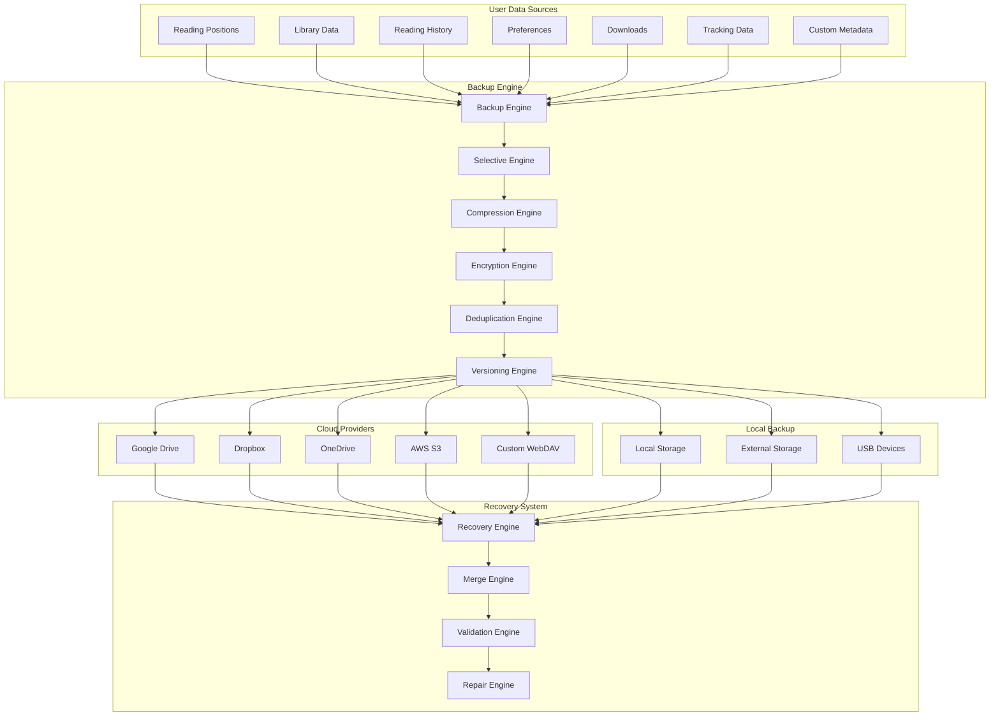

# Smart Backup System Design
## Comprehensive Reading Data Protection & Multi-Cloud Integration

## 🎯 Overview

The Smart Backup System provides comprehensive protection for all reading data with intelligent sync options, complete reading history backup, multi-cloud provider support, and automated disaster recovery capabilities.

## 🏗️ System Architecture

### Multi-Tier Backup Strategy



## 🛠️ Core Components

### Advanced Backup Engine

```kotlin
class SmartBackupEngine(
    private val database: AppDatabase,
    private val preferences: PreferencesHelper,
    private val encryptionManager: EncryptionManager,
    private val compressionManager: CompressionManager,
    private val cloudProviders: List<CloudProvider>,
    private val localStorageManager: LocalStorageManager
) {

    companion object {
        private const val BACKUP_VERSION = "3.0"
        private const val INCREMENTAL_BACKUP_THRESHOLD = 50 // MB
        private const val MAX_BACKUP_VERSIONS = 30
        private const val BACKUP_VERIFICATION_TIMEOUT = 60000L // 1 minute
    }

    suspend fun createBackup(request: BackupRequest): BackupResult {
        val backupSession = BackupSession(
            id = generateBackupId(),
            type = request.type,
            scope = request.scope,
            timestamp = System.currentTimeMillis(),
            deviceId = getDeviceId(),
            metadata = createBackupMetadata()
        )

        return try {
            when (request.type) {
                BackupType.FULL -> createFullBackup(backupSession, request)
                BackupType.INCREMENTAL -> createIncrementalBackup(backupSession, request)
                BackupType.SELECTIVE -> createSelectiveBackup(backupSession, request)
                BackupType.EMERGENCY -> createEmergencyBackup(backupSession, request)
            }
        } catch (e: Exception) {
            BackupResult.Failure(
                sessionId = backupSession.id,
                error = e.message ?: "Unknown backup error",
                partialData = null
            )
        }
    }

    private suspend fun createFullBackup(
        session: BackupSession,
        request: BackupRequest
    ): BackupResult {
        val startTime = System.currentTimeMillis()
        val backupData = mutableMapOf<String, Any>()
        val operationLog = mutableListOf<BackupOperation>()

        // 1. Reading Positions (Critical Data)
        operationLog.add(BackupOperation("reading_positions", "start"))
        val readingPositions = collectReadingPositions()
        backupData["reading_positions"] = readingPositions
        operationLog.add(BackupOperation("reading_positions", "complete", readingPositions.size))

        // 2. Library Data
        operationLog.add(BackupOperation("library_data", "start"))
        val libraryData = collectLibraryData(request.includeMetadata)
        backupData["library_data"] = libraryData
        operationLog.add(BackupOperation("library_data", "complete", libraryData.size))

        // 3. Reading History
        operationLog.add(BackupOperation("reading_history", "start"))
        val readingHistory = collectReadingHistory(request.historyDays)
        backupData["reading_history"] = readingHistory
        operationLog.add(BackupOperation("reading_history", "complete", readingHistory.size))

        // 4. User Preferences
        operationLog.add(BackupOperation("preferences", "start"))
        val userPreferences = collectUserPreferences(request.includeDeviceSpecific)
        backupData["preferences"] = userPreferences
        operationLog.add(BackupOperation("preferences", "complete", userPreferences.size))

        // 5. Tracking Data
        if (request.includeTracking) {
            operationLog.add(BackupOperation("tracking_data", "start"))
            val trackingData = collectTrackingData()
            backupData["tracking_data"] = trackingData
            operationLog.add(BackupOperation("tracking_data", "complete", trackingData.size))
        }

        // 6. Download Information
        if (request.includeDownloads) {
            operationLog.add(BackupOperation("download_info", "start"))
            val downloadInfo = collectDownloadInfo(request.includeDownloadedFiles)
            backupData["download_info"] = downloadInfo
            operationLog.add(BackupOperation("download_info", "complete", downloadInfo.size))
        }

        // 7. Custom Metadata
        if (request.includeCustomData) {
            operationLog.add(BackupOperation("custom_metadata", "start"))
            val customMetadata = collectCustomMetadata()
            backupData["custom_metadata"] = customMetadata
            operationLog.add(BackupOperation("custom_metadata", "complete", customMetadata.size))
        }

        // Create backup package
        val backupPackage = BackupPackage(
            version = BACKUP_VERSION,
            session = session,
            data = backupData,
            operationLog = operationLog,
            checksum = calculateChecksum(backupData),
            creationTime = startTime,
            completionTime = System.currentTimeMillis()
        )

        // Process and store backup
        return processBackupPackage(backupPackage, request)
    }

    private suspend fun createIncrementalBackup(
        session: BackupSession,
        request: BackupRequest
    ): BackupResult {
        val lastBackup = getLastBackupInfo(request.destinations)
        if (lastBackup == null) {
            // No previous backup found, create full backup
            return createFullBackup(session, request.copy(type = BackupType.FULL))
        }

        val changes = detectChanges(lastBackup.timestamp)
        if (changes.isEmpty()) {
            return BackupResult.Success(
                sessionId = session.id,
                backupSize = 0,
                destinations = emptyList(),
                isIncremental = true,
                message = "No changes detected since last backup"
            )
        }

        val incrementalData = mutableMapOf<String, Any>()
        val operationLog = mutableListOf<BackupOperation>()

        changes.forEach { change ->
            operationLog.add(BackupOperation(change.type, "start"))
            when (change.type) {
                "reading_positions" -> {
                    val changedPositions = getChangedReadingPositions(change.ids)
                    incrementalData["reading_positions"] = changedPositions
                    operationLog.add(BackupOperation(change.type, "complete", changedPositions.size))
                }
                "library_manga" -> {
                    val changedManga = getChangedLibraryManga(change.ids)
                    incrementalData["library_manga"] = changedManga
                    operationLog.add(BackupOperation(change.type, "complete", changedManga.size))
                }
                "preferences" -> {
                    val changedPreferences = getChangedPreferences(change.ids)
                    incrementalData["preferences"] = changedPreferences
                    operationLog.add(BackupOperation(change.type, "complete", changedPreferences.size))
                }
                // Handle other change types...
            }
        }

        val incrementalPackage = BackupPackage(
            version = BACKUP_VERSION,
            session = session,
            data = incrementalData,
            operationLog = operationLog,
            checksum = calculateChecksum(incrementalData),
            baseBackupId = lastBackup.id,
            isIncremental = true,
            changes = changes,
            creationTime = System.currentTimeMillis(),
            completionTime = System.currentTimeMillis()
        )

        return processBackupPackage(incrementalPackage, request)
    }

    private suspend fun processBackupPackage(
        backupPackage: BackupPackage,
        request: BackupRequest
    ): BackupResult {
        val results = mutableListOf<BackupDestinationResult>()

        // Serialize backup data
        val serializedData = serializeBackupData(backupPackage)

        // Apply compression if enabled
        val compressedData = if (request.compressionEnabled) {
            compressionManager.compress(serializedData, request.compressionLevel)
        } else {
            serializedData
        }

        // Apply encryption if enabled
        val finalData = if (request.encryptionEnabled) {
            encryptionManager.encrypt(compressedData, request.encryptionKey)
        } else {
            compressedData
        }

        // Store to requested destinations
        request.destinations.forEach { destination ->
            try {
                val result = storeBackup(destination, finalData, backupPackage)
                results.add(result)
            } catch (e: Exception) {
                results.add(
                    BackupDestinationResult(
                        destination = destination,
                        success = false,
                        error = e.message,
                        backupId = null,
                        uploadTime = null
                    )
                )
            }
        }

        // Verify backup integrity
        val verificationResults = verifyBackupIntegrity(results, backupPackage)

        return if (results.any { it.success }) {
            // Update backup registry
            updateBackupRegistry(backupPackage, results)

            BackupResult.Success(
                sessionId = backupPackage.session.id,
                backupSize = finalData.size.toLong(),
                destinations = results,
                isIncremental = backupPackage.isIncremental,
                verificationResults = verificationResults
            )
        } else {
            BackupResult.Failure(
                sessionId = backupPackage.session.id,
                error = "Failed to store backup to any destination",
                partialData = results
            )
        }
    }

    private suspend fun storeBackup(
        destination: BackupDestination,
        data: ByteArray,
        backupPackage: BackupPackage
    ): BackupDestinationResult {
        val startTime = System.currentTimeMillis()

        return when (destination.type) {
            BackupDestinationType.GOOGLE_DRIVE -> {
                val provider = cloudProviders.find { it.type == CloudProviderType.GOOGLE_DRIVE }
                val backupId = provider?.upload(data, generateBackupFileName(backupPackage))
                BackupDestinationResult(
                    destination = destination,
                    success = backupId != null,
                    backupId = backupId,
                    uploadTime = System.currentTimeMillis() - startTime
                )
            }
            BackupDestinationType.DROPBOX -> {
                val provider = cloudProviders.find { it.type == CloudProviderType.DROPBOX }
                val backupId = provider?.upload(data, generateBackupFileName(backupPackage))
                BackupDestinationResult(
                    destination = destination,
                    success = backupId != null,
                    backupId = backupId,
                    uploadTime = System.currentTimeMillis() - startTime
                )
            }
            BackupDestinationType.LOCAL_STORAGE -> {
                val success = localStorageManager.saveBackup(data, backupPackage)
                BackupDestinationResult(
                    destination = destination,
                    success = success,
                    backupId = if (success) backupPackage.session.id else null,
                    uploadTime = System.currentTimeMillis() - startTime
                )
            }
            // Handle other destination types...
        }
    }
}

data class BackupRequest(
    val type: BackupType,
    val scope: BackupScope,
    val destinations: List<BackupDestination>,
    val compressionEnabled: Boolean = true,
    val compressionLevel: CompressionLevel = CompressionLevel.BALANCED,
    val encryptionEnabled: Boolean = false,
    val encryptionKey: String? = null,
    val includeMetadata: Boolean = true,
    val includeTracking: Boolean = true,
    val includeDownloads: Boolean = false,
    val includeDownloadedFiles: Boolean = false,
    val includeCustomData: Boolean = true,
    val includeDeviceSpecific: Boolean = false,
    val historyDays: Int = 365,
    val maxBackupSize: Long = 500 * 1024 * 1024, // 500MB
    val verificationEnabled: Boolean = true
)

enum class BackupType {
    FULL,        // Complete backup of all data
    INCREMENTAL, // Only changes since last backup
    SELECTIVE,   // User-selected data categories
    EMERGENCY    // Critical data only for urgent situations
}

enum class BackupScope {
    ALL_DATA,           // Everything
    READING_DATA_ONLY,  // Positions, history, library
    PREFERENCES_ONLY,   // Settings and customizations
    CUSTOM             // User-defined scope
}

data class BackupDestination(
    val type: BackupDestinationType,
    val config: Map<String, String> = emptyMap(),
    val priority: Int = 1, // Higher number = higher priority
    val enabled: Boolean = true
)

enum class BackupDestinationType {
    GOOGLE_DRIVE,
    DROPBOX,
    ONEDRIVE,
    AWS_S3,
    WEBDAV,
    LOCAL_STORAGE,
    EXTERNAL_STORAGE,
    USB_DEVICE
}

data class BackupPackage(
    val version: String,
    val session: BackupSession,
    val data: Map<String, Any>,
    val operationLog: List<BackupOperation>,
    val checksum: String,
    val baseBackupId: String? = null, // For incremental backups
    val isIncremental: Boolean = false,
    val changes: List<DataChange> = emptyList(),
    val creationTime: Long,
    val completionTime: Long
)

data class BackupSession(
    val id: String,
    val type: BackupType,
    val scope: BackupScope,
    val timestamp: Long,
    val deviceId: String,
    val metadata: BackupMetadata
)

data class BackupOperation(
    val operation: String,
    val status: String,
    val itemCount: Int = 0,
    val timestamp: Long = System.currentTimeMillis()
)

sealed class BackupResult {
    data class Success(
        val sessionId: String,
        val backupSize: Long,
        val destinations: List<BackupDestinationResult>,
        val isIncremental: Boolean = false,
        val verificationResults: List<VerificationResult> = emptyList(),
        val message: String = "Backup completed successfully"
    ) : BackupResult()

    data class Failure(
        val sessionId: String,
        val error: String,
        val partialData: Any? = null
    ) : BackupResult()
}

data class BackupDestinationResult(
    val destination: BackupDestination,
    val success: Boolean,
    val backupId: String? = null,
    val uploadTime: Long? = null,
    val error: String? = null
)
```

## 🔄 Selective Sync Configuration

### Granular Data Selection

```kotlin
class SelectiveSyncManager(
    private val database: AppDatabase,
    private val preferences: PreferencesHelper
) {

    fun getSelectiveSyncConfiguration(): SelectiveSyncConfig {
        return SelectiveSyncConfig(
            readingPositions = ReadingPositionSyncConfig(
                enabled = preferences.syncReadingPositions().get(),
                scope = ReadingPositionScope.valueOf(preferences.syncPositionScope().get()),
                maxHistoryDays = preferences.syncPositionHistoryDays().get(),
                conflictResolution = ConflictResolutionStrategy.valueOf(preferences.positionConflictResolution().get()),
                includePageProgress = preferences.syncPageProgress().get(),
                includeScrollProgress = preferences.syncScrollProgress().get(),
                includePanelProgress = preferences.syncPanelProgress().get(),
                includeZoomLevel = preferences.syncZoomLevel().get()
            ),

            libraryData = LibraryDataSyncConfig(
                enabled = preferences.syncLibraryData().get(),
                includeMangaMetadata = preferences.syncMangaMetadata().get(),
                includeCustomCovers = preferences.syncCustomCovers().get(),
                includeCategories = preferences.syncCategories().get(),
                includeFavorites = preferences.syncFavorites().get(),
                includeReadStatus = preferences.syncReadStatus().get(),
                includeCustomTags = preferences.syncCustomTags().get(),
                maxLibrarySize = preferences.maxLibrarySize().get(),
                categoryFilters = preferences.syncCategoryFilters().get().toSet()
            ),

            readingHistory = ReadingHistorySyncConfig(
                enabled = preferences.syncReadingHistory().get(),
                maxHistoryEntries = preferences.maxHistoryEntries().get(),
                includeReadingTime = preferences.syncReadingTime().get(),
                includeSessionData = preferences.syncSessionData().get(),
                retentionDays = preferences.historyRetentionDays().get(),
                privacyMode = PrivacyMode.valueOf(preferences.historyPrivacyMode().get())
            ),

            preferences = PreferencesSyncConfig(
                enabled = preferences.syncPreferences().get(),
                includeReaderSettings = preferences.syncReaderSettings().get(),
                includeUISettings = preferences.syncUISettings().get(),
                includeDownloadSettings = preferences.syncDownloadSettings().get(),
                includeSecuritySettings = false, // Never sync security settings
                includeDeviceSpecific = preferences.syncDeviceSpecific().get(),
                deviceProfileEnabled = preferences.deviceProfileEnabled().get(),
                globalOverrides = preferences.globalPreferenceOverrides().get().toSet()
            ),

            trackingData = TrackingDataSyncConfig(
                enabled = preferences.syncTrackingData().get(),
                includeMAL = preferences.syncMAL().get(),
                includeAniList = preferences.syncAniList().get(),
                includeKitsu = preferences.syncKitsu().get(),
                includeBangumi = preferences.syncBangumi().get(),
                includeCustomTrackers = preferences.syncCustomTrackers().get(),
                conflictResolution = TrackingConflictResolution.valueOf(preferences.trackingConflictResolution().get()),
                autoSyncInterval = preferences.trackingAutoSyncInterval().get()
            ),

            downloadData = DownloadDataSyncConfig(
                enabled = preferences.syncDownloadData().get(),
                includeDownloadQueue = preferences.syncDownloadQueue().get(),
                includeDownloadedChapters = preferences.syncDownloadedChapters().get(),
                includeDownloadPreferences = preferences.syncDownloadPreferences().get(),
                syncDownloadedFiles = preferences.syncDownloadedFiles().get(),
                maxDownloadSize = preferences.maxDownloadSyncSize().get(),
                compressionLevel = CompressionLevel.valueOf(preferences.downloadCompressionLevel().get())
            ),

            customData = CustomDataSyncConfig(
                enabled = preferences.syncCustomData().get(),
                includeNotes = preferences.syncNotes().get(),
                includeBookmarks = preferences.syncBookmarks().get(),
                includeCustomMetadata = preferences.syncCustomMetadata().get(),
                includeExtensionData = preferences.syncExtensionData().get(),
                maxCustomDataSize = preferences.maxCustomDataSize().get(),
                encryptionEnabled = preferences.encryptCustomData().get()
            )
        )
    }

    suspend fun updateSelectiveSyncConfig(config: SelectiveSyncConfig) {
        // Update reading positions config
        preferences.syncReadingPositions().set(config.readingPositions.enabled)
        preferences.syncPositionScope().set(config.readingPositions.scope.name)
        preferences.syncPositionHistoryDays().set(config.readingPositions.maxHistoryDays)
        preferences.positionConflictResolution().set(config.readingPositions.conflictResolution.name)
        preferences.syncPageProgress().set(config.readingPositions.includePageProgress)
        preferences.syncScrollProgress().set(config.readingPositions.includeScrollProgress)
        preferences.syncPanelProgress().set(config.readingPositions.includePanelProgress)
        preferences.syncZoomLevel().set(config.readingPositions.includeZoomLevel)

        // Update library data config
        preferences.syncLibraryData().set(config.libraryData.enabled)
        preferences.syncMangaMetadata().set(config.libraryData.includeMangaMetadata)
        preferences.syncCustomCovers().set(config.libraryData.includeCustomCovers)
        preferences.syncCategories().set(config.libraryData.includeCategories)
        preferences.syncFavorites().set(config.libraryData.includeFavorites)
        preferences.syncReadStatus().set(config.libraryData.includeReadStatus)
        preferences.syncCustomTags().set(config.libraryData.includeCustomTags)
        preferences.maxLibrarySize().set(config.libraryData.maxLibrarySize)
        preferences.syncCategoryFilters().set(config.libraryData.categoryFilters.joinToString(","))

        // Update other configs...

        // Validate configuration
        validateSyncConfiguration(config)

        // Trigger immediate sync if enabled
        if (preferences.autoSyncOnConfigChange().get()) {
            triggerConfigSync(config)
        }
    }

    private fun validateSyncConfiguration(config: SelectiveSyncConfig) {
        val issues = mutableListOf<String>()

        // Check for conflicting settings
        if (!config.readingPositions.enabled && config.readingHistory.includeReadingTime) {
            issues.add("Reading time sync requires reading positions to be enabled")
        }

        if (config.downloadData.syncDownloadedFiles && config.downloadData.maxDownloadSize < 100 * 1024 * 1024) {
            issues.add("Download file sync requires at least 100MB max size")
        }

        if (config.customData.encryptionEnabled && !preferences.hasEncryptionKey().get()) {
            issues.add("Custom data encryption requires encryption key to be set")
        }

        // Check storage requirements
        val estimatedSize = estimateConfigStorageRequirements(config)
        val availableStorage = getAvailableCloudStorage()

        if (estimatedSize > availableStorage) {
            issues.add("Configuration exceeds available cloud storage (${estimatedSize}MB > ${availableStorage}MB)")
        }

        if (issues.isNotEmpty()) {
            throw InvalidSyncConfigurationException(issues)
        }
    }

    fun generateSyncSizeEstimate(config: SelectiveSyncConfig): SyncSizeEstimate {
        val estimates = mutableMapOf<String, Long>()

        if (config.readingPositions.enabled) {
            estimates["reading_positions"] = estimateReadingPositionsSize(config.readingPositions)
        }

        if (config.libraryData.enabled) {
            estimates["library_data"] = estimateLibraryDataSize(config.libraryData)
        }

        if (config.readingHistory.enabled) {
            estimates["reading_history"] = estimateReadingHistorySize(config.readingHistory)
        }

        if (config.preferences.enabled) {
            estimates["preferences"] = estimatePreferencesSize(config.preferences)
        }

        if (config.trackingData.enabled) {
            estimates["tracking_data"] = estimateTrackingDataSize(config.trackingData)
        }

        if (config.downloadData.enabled) {
            estimates["download_data"] = estimateDownloadDataSize(config.downloadData)
        }

        if (config.customData.enabled) {
            estimates["custom_data"] = estimateCustomDataSize(config.customData)
        }

        return SyncSizeEstimate(
            categoryEstimates = estimates,
            totalEstimatedSize = estimates.values.sum(),
            compressionSavings = estimates.values.sum() * 0.3, // Assume 30% compression
            encryptionOverhead = if (hasEncryptionEnabled(config)) estimates.values.sum() * 0.05 else 0.0 // 5% encryption overhead
        )
    }
}

data class SelectiveSyncConfig(
    val readingPositions: ReadingPositionSyncConfig,
    val libraryData: LibraryDataSyncConfig,
    val readingHistory: ReadingHistorySyncConfig,
    val preferences: PreferencesSyncConfig,
    val trackingData: TrackingDataSyncConfig,
    val downloadData: DownloadDataSyncConfig,
    val customData: CustomDataSyncConfig
)

data class ReadingPositionSyncConfig(
    val enabled: Boolean,
    val scope: ReadingPositionScope,
    val maxHistoryDays: Int,
    val conflictResolution: ConflictResolutionStrategy,
    val includePageProgress: Boolean,
    val includeScrollProgress: Boolean,
    val includePanelProgress: Boolean,
    val includeZoomLevel: Boolean
)

enum class ReadingPositionScope {
    ALL_MANGA,          // Sync positions for all manga
    LIBRARY_ONLY,       // Only manga in library
    RECENTLY_READ,      // Only recently read manga
    FAVORITES_ONLY,     // Only favorited manga
    CUSTOM_CATEGORIES   // User-selected categories
}

data class LibraryDataSyncConfig(
    val enabled: Boolean,
    val includeMangaMetadata: Boolean,
    val includeCustomCovers: Boolean,
    val includeCategories: Boolean,
    val includeFavorites: Boolean,
    val includeReadStatus: Boolean,
    val includeCustomTags: Boolean,
    val maxLibrarySize: Int,
    val categoryFilters: Set<String>
)

data class ReadingHistorySyncConfig(
    val enabled: Boolean,
    val maxHistoryEntries: Int,
    val includeReadingTime: Boolean,
    val includeSessionData: Boolean,
    val retentionDays: Int,
    val privacyMode: PrivacyMode
)

enum class PrivacyMode {
    FULL,               // Sync all history data
    METADATA_ONLY,      // Sync without sensitive data
    AGGREGATE_ONLY,     // Only aggregate statistics
    DISABLED            // No history sync
}

data class SyncSizeEstimate(
    val categoryEstimates: Map<String, Long>,
    val totalEstimatedSize: Long,
    val compressionSavings: Double,
    val encryptionOverhead: Double
) {
    val finalEstimatedSize: Long
        get() = (totalEstimatedSize - compressionSavings + encryptionOverhead).toLong()
}
```

## ☁️ Multi-Cloud Provider Integration

### Universal Cloud Provider Interface

```kotlin
interface CloudProvider {
    val type: CloudProviderType
    val isConfigured: Boolean
    val isAuthenticated: Boolean
    val availableStorage: Long
    val usedStorage: Long

    suspend fun authenticate(credentials: CloudCredentials): AuthenticationResult
    suspend fun upload(data: ByteArray, fileName: String, metadata: Map<String, String> = emptyMap()): String?
    suspend fun download(fileId: String): ByteArray?
    suspend fun delete(fileId: String): Boolean
    suspend fun list(path: String = ""): List<CloudFile>
    suspend fun getFile(fileId: String): CloudFile?
    suspend fun updateMetadata(fileId: String, metadata: Map<String, String>): Boolean
    suspend fun createFolder(name: String, parentId: String? = null): String?
    suspend fun getStorageInfo(): StorageInfo
    suspend fun testConnection(): ConnectionTestResult
}

class GoogleDriveProvider(
    private val context: Context,
    private val encryptionManager: EncryptionManager
) : CloudProvider {

    override val type = CloudProviderType.GOOGLE_DRIVE
    private var driveService: Drive? = null
    private val appFolderName = "TachiyomiJ2K Backups"
    private var appFolderId: String? = null

    override val isConfigured: Boolean
        get() = getStoredCredentials() != null

    override val isAuthenticated: Boolean
        get() = driveService != null && testTokenValidity()

    override val availableStorage: Long
        get() = getStorageInfo().availableBytes

    override val usedStorage: Long
        get() = getStorageInfo().usedBytes

    override suspend fun authenticate(credentials: CloudCredentials): AuthenticationResult {
        return try {
            val googleCredentials = credentials as GoogleDriveCredentials

            val credential = GoogleAccountCredential.usingOAuth2(
                context,
                listOf(DriveScopes.DRIVE_FILE, DriveScopes.DRIVE_APPDATA)
            ).apply {
                selectedAccountName = googleCredentials.accountName
            }

            driveService = Drive.Builder(
                AndroidHttp.newCompatibleTransport(),
                JacksonFactory.getDefaultInstance(),
                credential
            )
                .setApplicationName("TachiyomiJ2K")
                .build()

            // Create app folder if it doesn't exist
            appFolderId = findOrCreateAppFolder()

            // Store credentials securely
            storeCredentials(credentials)

            AuthenticationResult.Success("Successfully authenticated with Google Drive")

        } catch (e: Exception) {
            AuthenticationResult.Failure("Google Drive authentication failed: ${e.message}")
        }
    }

    override suspend fun upload(
        data: ByteArray,
        fileName: String,
        metadata: Map<String, String>
    ): String? {
        return withContext(Dispatchers.IO) {
            try {
                val drive = driveService ?: throw IllegalStateException("Not authenticated")

                // Create file metadata
                val fileMetadata = File().apply {
                    name = fileName
                    parents = listOf(appFolderId)
                    description = "TachiyomiJ2K backup created on ${Date()}"

                    // Add custom metadata
                    properties = metadata.toMutableMap().apply {
                        put("backup_version", BACKUP_VERSION)
                        put("app_version", BuildConfig.VERSION_NAME)
                        put("created_timestamp", System.currentTimeMillis().toString())
                    }
                }

                // Upload file content
                val mediaContent = ByteArrayContent("application/octet-stream", data)

                val request = drive.files().create(fileMetadata, mediaContent)
                    .setFields("id,name,size,createdTime,properties")

                val uploadedFile = request.execute()
                uploadedFile.id

            } catch (e: Exception) {
                Timber.e(e, "Failed to upload to Google Drive")
                null
            }
        }
    }

    override suspend fun download(fileId: String): ByteArray? {
        return withContext(Dispatchers.IO) {
            try {
                val drive = driveService ?: throw IllegalStateException("Not authenticated")

                val outputStream = ByteArrayOutputStream()
                drive.files().get(fileId).executeMediaAndDownloadTo(outputStream)
                outputStream.toByteArray()

            } catch (e: Exception) {
                Timber.e(e, "Failed to download from Google Drive")
                null
            }
        }
    }

    override suspend fun list(path: String): List<CloudFile> {
        return withContext(Dispatchers.IO) {
            try {
                val drive = driveService ?: throw IllegalStateException("Not authenticated")

                val query = "'$appFolderId' in parents and trashed=false"
                val result = drive.files().list()
                    .setQ(query)
                    .setFields("files(id,name,size,createdTime,modifiedTime,properties)")
                    .setOrderBy("createdTime desc")
                    .execute()

                result.files.map { file ->
                    CloudFile(
                        id = file.id,
                        name = file.name,
                        size = file.size ?: 0,
                        createdTime = file.createdTime?.value ?: 0,
                        modifiedTime = file.modifiedTime?.value ?: 0,
                        metadata = file.properties ?: emptyMap(),
                        provider = type
                    )
                }

            } catch (e: Exception) {
                Timber.e(e, "Failed to list Google Drive files")
                emptyList()
            }
        }
    }

    override suspend fun getStorageInfo(): StorageInfo {
        return withContext(Dispatchers.IO) {
            try {
                val drive = driveService ?: throw IllegalStateException("Not authenticated")

                val about = drive.about().get()
                    .setFields("storageQuota")
                    .execute()

                val quota = about.storageQuota
                StorageInfo(
                    totalBytes = quota.limit ?: Long.MAX_VALUE,
                    usedBytes = quota.usage ?: 0,
                    availableBytes = (quota.limit ?: Long.MAX_VALUE) - (quota.usage ?: 0)
                )

            } catch (e: Exception) {
                Timber.e(e, "Failed to get Google Drive storage info")
                StorageInfo(0, 0, 0)
            }
        }
    }

    private suspend fun findOrCreateAppFolder(): String {
        val drive = driveService ?: throw IllegalStateException("Not authenticated")

        // Search for existing app folder
        val query = "name='$appFolderName' and mimeType='application/vnd.google-apps.folder' and trashed=false"
        val result = drive.files().list()
            .setQ(query)
            .setFields("files(id,name)")
            .execute()

        return if (result.files.isNotEmpty()) {
            result.files[0].id
        } else {
            // Create new app folder
            val folderMetadata = File().apply {
                name = appFolderName
                mimeType = "application/vnd.google-apps.folder"
                description = "TachiyomiJ2K backup storage folder"
            }

            val folder = drive.files().create(folderMetadata)
                .setFields("id")
                .execute()

            folder.id
        }
    }
}

class DropboxProvider(
    private val context: Context,
    private val encryptionManager: EncryptionManager
) : CloudProvider {

    override val type = CloudProviderType.DROPBOX
    private var dbxClient: DbxClientV2? = null
    private val appFolderPath = "/Apps/TachiyomiJ2K"

    override suspend fun authenticate(credentials: CloudCredentials): AuthenticationResult {
        return try {
            val dropboxCredentials = credentials as DropboxCredentials

            val config = DbxRequestConfig.newBuilder("TachiyomiJ2K")
                .withUserLocale(Locale.getDefault().toString())
                .build()

            dbxClient = DbxClientV2(config, dropboxCredentials.accessToken)

            // Test connection
            dbxClient!!.users().currentAccount

            // Create app folder if it doesn't exist
            createAppFolderIfNeeded()

            storeCredentials(credentials)
            AuthenticationResult.Success("Successfully authenticated with Dropbox")

        } catch (e: Exception) {
            AuthenticationResult.Failure("Dropbox authentication failed: ${e.message}")
        }
    }

    override suspend fun upload(
        data: ByteArray,
        fileName: String,
        metadata: Map<String, String>
    ): String? {
        return withContext(Dispatchers.IO) {
            try {
                val client = dbxClient ?: throw IllegalStateException("Not authenticated")

                val filePath = "$appFolderPath/$fileName"

                val uploadBuilder = client.files().uploadBuilder(filePath)
                    .withMode(WriteMode.OVERWRITE)
                    .withClientModified(Date())

                val uploadedFile = uploadBuilder.uploadAndFinish(data.inputStream())
                uploadedFile.id

            } catch (e: Exception) {
                Timber.e(e, "Failed to upload to Dropbox")
                null
            }
        }
    }

    // Implement other CloudProvider methods for Dropbox...
}

// Additional cloud providers: OneDriveProvider, AWSS3Provider, WebDAVProvider...

enum class CloudProviderType {
    GOOGLE_DRIVE,
    DROPBOX,
    ONEDRIVE,
    AWS_S3,
    WEBDAV,
    CUSTOM
}

data class CloudFile(
    val id: String,
    val name: String,
    val size: Long,
    val createdTime: Long,
    val modifiedTime: Long,
    val metadata: Map<String, String>,
    val provider: CloudProviderType
)

data class StorageInfo(
    val totalBytes: Long,
    val usedBytes: Long,
    val availableBytes: Long
) {
    val usagePercentage: Float
        get() = if (totalBytes > 0) usedBytes.toFloat() / totalBytes.toFloat() else 0f
}

sealed class AuthenticationResult {
    data class Success(val message: String) : AuthenticationResult()
    data class Failure(val error: String) : AuthenticationResult()
}

sealed class CloudCredentials {
    data class GoogleDriveCredentials(
        val accountName: String,
        val accessToken: String,
        val refreshToken: String
    ) : CloudCredentials()

    data class DropboxCredentials(
        val accessToken: String
    ) : CloudCredentials()

    data class OneDriveCredentials(
        val accessToken: String,
        val refreshToken: String
    ) : CloudCredentials()
}
```

## 🚨 Disaster Recovery System

### Automated Recovery and Data Restoration

```kotlin
class DisasterRecoverySystem(
    private val backupEngine: SmartBackupEngine,
    private val cloudProviders: List<CloudProvider>,
    private val database: AppDatabase,
    private val preferences: PreferencesHelper,
    private val notificationManager: NotificationManager
) {

    companion object {
        private const val RECOVERY_ATTEMPT_TIMEOUT = 300000L // 5 minutes
        private const val MAX_RECOVERY_ATTEMPTS = 3
        private const val HEALTH_CHECK_INTERVAL = 6 * 60 * 60 * 1000L // 6 hours
    }

    suspend fun performDataHealthCheck(): HealthCheckResult {
        val issues = mutableListOf<DataIntegrityIssue>()
        val timestamp = System.currentTimeMillis()

        // Check database integrity
        val dbIntegrityResult = checkDatabaseIntegrity()
        if (!dbIntegrityResult.isHealthy) {
            issues.addAll(dbIntegrityResult.issues)
        }

        // Check critical data presence
        val criticalDataResult = checkCriticalDataPresence()
        if (!criticalDataResult.isHealthy) {
            issues.addAll(criticalDataResult.issues)
        }

        // Check backup currency
        val backupCurrencyResult = checkBackupCurrency()
        if (!backupCurrencyResult.isHealthy) {
            issues.addAll(backupCurrencyResult.issues)
        }

        // Check sync consistency
        val syncConsistencyResult = checkSyncConsistency()
        if (!syncConsistencyResult.isHealthy) {
            issues.addAll(syncConsistencyResult.issues)
        }

        val overallHealth = when {
            issues.none { it.severity == IssueSeverity.CRITICAL } -> HealthStatus.HEALTHY
            issues.any { it.severity == IssueSeverity.CRITICAL } -> HealthStatus.CRITICAL
            issues.any { it.severity == IssueSeverity.HIGH } -> HealthStatus.WARNING
            else -> HealthStatus.MINOR_ISSUES
        }

        val result = HealthCheckResult(
            timestamp = timestamp,
            overallHealth = overallHealth,
            issues = issues,
            recommendations = generateRecommendations(issues),
            nextCheckTime = timestamp + HEALTH_CHECK_INTERVAL
        )

        // Auto-resolve minor issues
        if (preferences.autoResolveMinorIssues().get()) {
            autoResolveIssues(issues.filter { it.autoResolvable })
        }

        // Alert user for critical issues
        if (overallHealth == HealthStatus.CRITICAL) {
            notifyUserOfCriticalIssues(issues.filter { it.severity == IssueSeverity.CRITICAL })
        }

        return result
    }

    suspend fun initiateDisasterRecovery(scenario: DisasterScenario): DisasterRecoveryResult {
        val recoverySession = DisasterRecoverySession(
            id = generateRecoverySessionId(),
            scenario = scenario,
            timestamp = System.currentTimeMillis(),
            deviceId = getDeviceId()
        )

        return try {
            when (scenario) {
                DisasterScenario.DATA_CORRUPTION -> recoverFromDataCorruption(recoverySession)
                DisasterScenario.DEVICE_LOSS -> recoverFromDeviceLoss(recoverySession)
                DisasterScenario.ACCIDENTAL_DELETION -> recoverFromAccidentalDeletion(recoverySession)
                DisasterScenario.SYNC_FAILURE -> recoverFromSyncFailure(recoverySession)
                DisasterScenario.CLOUD_PROVIDER_FAILURE -> recoverFromCloudFailure(recoverySession)
                DisasterScenario.COMPLETE_DATA_LOSS -> recoverFromCompleteDataLoss(recoverySession)
            }
        } catch (e: Exception) {
            DisasterRecoveryResult.Failure(
                sessionId = recoverySession.id,
                error = "Recovery process failed: ${e.message}",
                partialRecovery = null
            )
        }
    }

    private suspend fun recoverFromDataCorruption(session: DisasterRecoverySession): DisasterRecoveryResult {
        val recoverySteps = mutableListOf<RecoveryStep>()
        val startTime = System.currentTimeMillis()

        // Step 1: Identify corrupted data
        recoverySteps.add(RecoveryStep("identify_corruption", "start"))
        val corruptionAnalysis = analyzeDataCorruption()
        recoverySteps.add(RecoveryStep("identify_corruption", "complete", corruptionAnalysis.corruptedTables.size))

        // Step 2: Find latest clean backup
        recoverySteps.add(RecoveryStep("find_clean_backup", "start"))
        val cleanBackup = findLatestCleanBackup(corruptionAnalysis.corruptionTimestamp)
        if (cleanBackup == null) {
            return DisasterRecoveryResult.Failure(
                sessionId = session.id,
                error = "No clean backup found before corruption timestamp",
                partialRecovery = null
            )
        }
        recoverySteps.add(RecoveryStep("find_clean_backup", "complete"))

        // Step 3: Create emergency backup of current state
        recoverySteps.add(RecoveryStep("emergency_backup", "start"))
        val emergencyBackupResult = backupEngine.createBackup(
            BackupRequest(
                type = BackupType.EMERGENCY,
                scope = BackupScope.ALL_DATA,
                destinations = listOf(BackupDestination(BackupDestinationType.LOCAL_STORAGE))
            )
        )
        recoverySteps.add(RecoveryStep("emergency_backup", "complete"))

        // Step 4: Restore from clean backup
        recoverySteps.add(RecoveryStep("restore_clean_data", "start"))
        val restorationResult = restoreFromBackup(cleanBackup, RestoreOptions(
            replaceCorruptedData = true,
            preserveRecentChanges = true,
            mergeNonCorruptedData = true
        ))
        recoverySteps.add(RecoveryStep("restore_clean_data", "complete", restorationResult.restoredItems))

        // Step 5: Attempt to recover recent changes
        recoverySteps.add(RecoveryStep("recover_recent_changes", "start"))
        val recentChangesRecovered = recoverRecentChanges(
            cleanBackup.timestamp,
            corruptionAnalysis.corruptionTimestamp,
            emergencyBackupResult
        )
        recoverySteps.add(RecoveryStep("recover_recent_changes", "complete", recentChangesRecovered.size))

        // Step 6: Validate recovery
        recoverySteps.add(RecoveryStep("validate_recovery", "start"))
        val validationResult = validateRecoveredData()
        recoverySteps.add(RecoveryStep("validate_recovery", "complete"))

        return if (validationResult.isValid) {
            DisasterRecoveryResult.Success(
                sessionId = session.id,
                recoveryType = RecoveryType.DATA_CORRUPTION,
                recoveredData = restorationResult.restoredData,
                recoverySteps = recoverySteps,
                duration = System.currentTimeMillis() - startTime,
                dataLoss = calculateDataLoss(cleanBackup.timestamp, corruptionAnalysis.corruptionTimestamp)
            )
        } else {
            DisasterRecoveryResult.PartialSuccess(
                sessionId = session.id,
                recoveredData = restorationResult.restoredData,
                remainingIssues = validationResult.issues,
                recoverySteps = recoverySteps
            )
        }
    }

    private suspend fun recoverFromCompleteDataLoss(session: DisasterRecoverySession): DisasterRecoveryResult {
        val recoverySteps = mutableListOf<RecoveryStep>()
        val startTime = System.currentTimeMillis()

        // Step 1: Search all cloud providers for backups
        recoverySteps.add(RecoveryStep("search_cloud_backups", "start"))
        val availableBackups = searchAllCloudProvidersForBackups()
        if (availableBackups.isEmpty()) {
            return DisasterRecoveryResult.Failure(
                sessionId = session.id,
                error = "No backups found in any cloud provider",
                partialRecovery = null
            )
        }
        recoverySteps.add(RecoveryStep("search_cloud_backups", "complete", availableBackups.size))

        // Step 2: Select best backup for recovery
        recoverySteps.add(RecoveryStep("select_best_backup", "start"))
        val bestBackup = selectBestBackupForRecovery(availableBackups)
        recoverySteps.add(RecoveryStep("select_best_backup", "complete"))

        // Step 3: Download and verify backup
        recoverySteps.add(RecoveryStep("download_backup", "start"))
        val downloadedBackup = downloadAndVerifyBackup(bestBackup)
        if (downloadedBackup == null) {
            return DisasterRecoveryResult.Failure(
                sessionId = session.id,
                error = "Failed to download or verify backup",
                partialRecovery = null
            )
        }
        recoverySteps.add(RecoveryStep("download_backup", "complete"))

        // Step 4: Initialize fresh database
        recoverySteps.add(RecoveryStep("initialize_database", "start"))
        initializeFreshDatabase()
        recoverySteps.add(RecoveryStep("initialize_database", "complete"))

        // Step 5: Restore all data from backup
        recoverySteps.add(RecoveryStep("restore_all_data", "start"))
        val fullRestorationResult = restoreFromBackup(downloadedBackup, RestoreOptions(
            replaceAllData = true,
            preserveDeviceSpecific = false,
            mergeData = false
        ))
        recoverySteps.add(RecoveryStep("restore_all_data", "complete", fullRestorationResult.restoredItems))

        // Step 6: Rebuild indices and optimize database
        recoverySteps.add(RecoveryStep("rebuild_indices", "start"))
        rebuildDatabaseIndices()
        recoverySteps.add(RecoveryStep("rebuild_indices", "complete"))

        // Step 7: Validate complete restoration
        recoverySteps.add(RecoveryStep("validate_restoration", "start"))
        val finalValidation = validateCompleteRestoration()
        recoverySteps.add(RecoveryStep("validate_restoration", "complete"))

        return if (finalValidation.isValid) {
            DisasterRecoveryResult.Success(
                sessionId = session.id,
                recoveryType = RecoveryType.COMPLETE_RESTORATION,
                recoveredData = fullRestorationResult.restoredData,
                recoverySteps = recoverySteps,
                duration = System.currentTimeMillis() - startTime,
                dataLoss = calculateDataLossFromBackup(bestBackup)
            )
        } else {
            DisasterRecoveryResult.PartialSuccess(
                sessionId = session.id,
                recoveredData = fullRestorationResult.restoredData,
                remainingIssues = finalValidation.issues,
                recoverySteps = recoverySteps
            )
        }
    }

    private suspend fun searchAllCloudProvidersForBackups(): List<CloudBackupInfo> {
        val allBackups = mutableListOf<CloudBackupInfo>()

        cloudProviders.forEach { provider ->
            try {
                if (provider.isAuthenticated) {
                    val backups = provider.list("").mapNotNull { cloudFile ->
                        if (isValidBackupFile(cloudFile)) {
                            CloudBackupInfo(
                                cloudFile = cloudFile,
                                provider = provider,
                                metadata = parseBackupMetadata(cloudFile)
                            )
                        } else null
                    }
                    allBackups.addAll(backups)
                }
            } catch (e: Exception) {
                Timber.e(e, "Failed to search backups in ${provider.type}")
            }
        }

        return allBackups.sortedByDescending { it.cloudFile.createdTime }
    }

    private fun selectBestBackupForRecovery(backups: List<CloudBackupInfo>): CloudBackupInfo {
        return backups.maxByOrNull { backup ->
            var score = 0

            // Prefer more recent backups
            val ageHours = (System.currentTimeMillis() - backup.cloudFile.createdTime) / (1000 * 60 * 60)
            score += (100 - minOf(ageHours.toInt(), 100))

            // Prefer full backups over incremental
            if (backup.metadata?.backupType == BackupType.FULL) score += 50

            // Prefer larger backups (more complete data)
            score += minOf(backup.cloudFile.size.toInt() / (1024 * 1024), 20) // Size in MB, max 20 points

            // Prefer verified backups
            if (backup.metadata?.isVerified == true) score += 30

            // Prefer backups from reliable providers
            when (backup.provider.type) {
                CloudProviderType.GOOGLE_DRIVE -> score += 10
                CloudProviderType.DROPBOX -> score += 8
                CloudProviderType.ONEDRIVE -> score += 6
                else -> score += 0
            }

            score
        } ?: backups.first()
    }
}

enum class DisasterScenario {
    DATA_CORRUPTION,
    DEVICE_LOSS,
    ACCIDENTAL_DELETION,
    SYNC_FAILURE,
    CLOUD_PROVIDER_FAILURE,
    COMPLETE_DATA_LOSS
}

enum class HealthStatus {
    HEALTHY,
    MINOR_ISSUES,
    WARNING,
    CRITICAL
}

data class HealthCheckResult(
    val timestamp: Long,
    val overallHealth: HealthStatus,
    val issues: List<DataIntegrityIssue>,
    val recommendations: List<String>,
    val nextCheckTime: Long
)

data class DataIntegrityIssue(
    val type: IssueType,
    val severity: IssueSeverity,
    val description: String,
    val affectedData: String,
    val autoResolvable: Boolean,
    val resolution: String?
)

enum class IssueType {
    DATABASE_CORRUPTION,
    MISSING_CRITICAL_DATA,
    OUTDATED_BACKUP,
    SYNC_INCONSISTENCY,
    STORAGE_QUOTA_EXCEEDED,
    AUTHENTICATION_FAILURE
}

enum class IssueSeverity {
    LOW,
    MEDIUM,
    HIGH,
    CRITICAL
}

sealed class DisasterRecoveryResult {
    data class Success(
        val sessionId: String,
        val recoveryType: RecoveryType,
        val recoveredData: Map<String, Any>,
        val recoverySteps: List<RecoveryStep>,
        val duration: Long,
        val dataLoss: DataLossInfo
    ) : DisasterRecoveryResult()

    data class PartialSuccess(
        val sessionId: String,
        val recoveredData: Map<String, Any>,
        val remainingIssues: List<String>,
        val recoverySteps: List<RecoveryStep>
    ) : DisasterRecoveryResult()

    data class Failure(
        val sessionId: String,
        val error: String,
        val partialRecovery: Map<String, Any>?
    ) : DisasterRecoveryResult()
}

enum class RecoveryType {
    DATA_CORRUPTION,
    DEVICE_MIGRATION,
    ACCIDENTAL_DELETION,
    SYNC_RESTORATION,
    CLOUD_RESTORATION,
    COMPLETE_RESTORATION
}

data class DataLossInfo(
    val timespan: Long, // milliseconds of data potentially lost
    val affectedCategories: List<String>,
    val estimatedItemsLost: Int,
    val severity: DataLossSeverity
)

enum class DataLossSeverity {
    NONE,
    MINIMAL,
    MODERATE,
    SIGNIFICANT,
    SEVERE
}
```

This comprehensive Smart Backup System provides enterprise-level data protection with intelligent sync options, complete reading history backup, multi-cloud provider support, and automated disaster recovery capabilities to ensure users never lose their reading progress and preferences.
